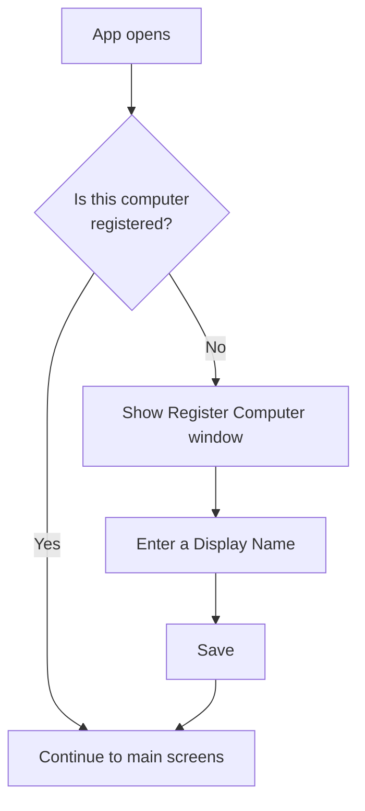
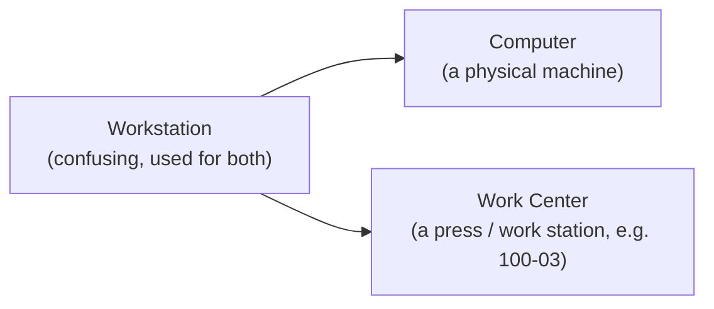
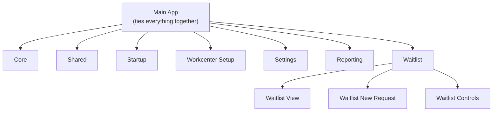
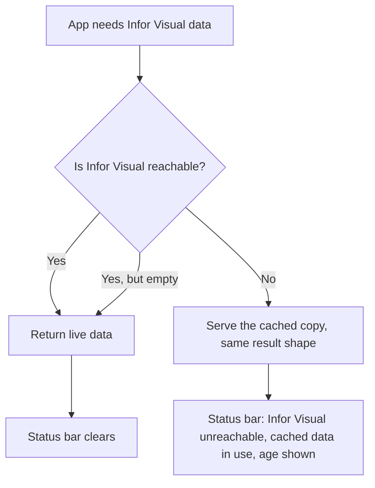

# MTM Waitlist — End-User Changelog

> **Audience:** End users / plant-floor operators, leads, and IT Department.
> This changelog covers **user-facing** changes primarily — what you can see and do differently
> in the app. Implementation details and internal plumbing are mostly excluded, but the module
> restructuring below is included because it affects how the app is built and maintained going
> forward.
>
> **Date:** 2026-08-29

---

## 2026-09-24 — the New Request wizard asks, then confirms: one review step instead of two

**What changed:** the wizard no longer shows a separate **Preview** step before **Confirm**. After the last
question — the details, or the dies, dunnage or components you pick — the next screen is the confirmation that
raises the request. The step strip across the top now reads six steps: Work Center → Category → Item → Details →
Confirm → Complete.

**Why it matters:** Preview showed a subset of the same fields (work center, item, details, the part's picture)
and nothing else: it checked nothing, changed nothing, and its only button led to Confirm. Every request therefore
cost an extra screen and an extra click to read the same information twice.

**What to expect:**

- **One review step.** Confirm still shows everything: the work center, the category, the item, the details you
  gave, the part's picture, the coil the current job carries, and — when a request will raise several entries — how
  many requests it will raise. It still refuses a duplicate, or a request whose current job has changed, and it is
  still the screen that actually raises the request.
- **Back on Confirm returns to your last answer** (the details, or the die / dunnage / component picker), not to a
  page in between.

---

## 2026-09-23 — every part has its own picture, and the pictures have a home you can change

**What changed:** the application can now picture **a part**, not just the kind of request it belongs to. A part's
picture appears wherever that part is named — the waitlist cards, the request detail page, the setup part list and
review, the wizard's die card, the confirmation step and the preview. A **Visual** part and a **WIP** part are
pictured separately, even when they share a part number, so one system's picture is never shown for the other. Where
there is no picture, the same **no-image** picture as everywhere else is drawn: never a blank space, and never
another part's or a family's artwork.

**Why it matters:** the waitlist card used to show the picture for the *kind of request*, so two requests for two
different parts looked alike, and a request for a part nobody had photographed still showed generic artwork. A person
on the floor could not tell from the card which part they were being asked for. Now the card shows the part.

**What to expect:**

- **Settings → Operations → Part Pictures** (IT Department, Developer, Setup Lead and Plant Manager) is a new screen:
  search for a part, see the picture it has, set or replace it, read who changed it and what it replaced, and see the
  list of parts that still have no picture — which can be exported in one action. Each part is listed and pictured
  under its system, so Visual and WIP parts are never confused.
- **A picture can be added without the application.** Drop a correctly named file into the picture folder — the part
  number, with `.png`, `.jpg` or `.jpeg`, in the folder for the part's family — and the application uses it.
- **Lists that ask you to choose by name are now cards with pictures**: the dunnage types that may be shown or
  hidden, the setup part list, the remaining answer list in the wizard, and the building choice — which is now a
  flyout of building cards with the building you are already in left out.
- **Settings → Operations → Storage folders** (IT Department and Developer) holds the picture folder, the key-file
  folder, and **how long a replaced picture is kept** (ninety days by default). All three are company-wide settings,
  so changing one here changes it on every computer. Where a computer's own configuration still names a different
  picture folder, the screen says so in one line: what is shown is what every computer reads, and the store is the
  truth.
- **Pictures arrive faster.** A part's picture is copied to your computer the **first time that part is drawn**,
  rather than every picture being copied when the application starts. A picture you replace shows up without
  restarting, and the picture it replaced is kept beside it until its retention period has passed. If the picture
  share cannot be reached, the screens still open and draw what they have.

**Housekeeping:** every picture the application already stored has been moved into the new arrangement — one folder
per collection, one per family — and every saved picture still resolves, so nothing needs to be set again by hand.
The pictures are still stored relative to the picture folder, so a machine that reaches the share by a different
route finds exactly the same picture.

---

## 2026-09-22 — pictures are copied onto your computer when the app starts

**What changed:** the application now keeps a copy of every picture on the computer it is running on, the same way
the MTM Receiving Application keeps its dunnage pictures. Each time it starts, it copies the pictures from the network
share into a folder on that computer, and every screen draws from the local copy. A picture that has changed on the
share is copied again; a picture that has not changed is left alone; and a copy whose picture has been taken off the
share is deleted. Anything with no picture still shows the same no-image picture as before.

**Why it matters:** the waitlist, the detail pages, the work-centre tiles and the dunnage search were each fetching
their pictures across the network every time they were drawn. With the pictures already on the computer, those screens
open without waiting for the network, and they keep working if the share is briefly unavailable — the copies are
already there.

**What to expect:** the startup splash shows a **Caching pictures from the network...** line while this happens. It is
best effort: if the share cannot be reached, or has nothing new, the application still opens and simply draws from
the share. The taskbar copy is small — the pictures are only ever copies, and the share stays the only place a picture
is ever changed.

### Settings → Operations → **Picture Cache** (IT Department and Developer)

A new section, directly under **Image Location Settings**, with three things in it:

- **Cache pictures on this computer** — off means every picture is read from the network share instead. This is one
  setting for the whole company: changing it on one computer changes it on all of them, on their next start.
- **Cache folder** — where the copies are kept. The default is inside the signed-in person's local application
  folder, so it needs no permission to write to; a different folder can be typed in and saved.
- **Copy pictures now** — does the same copy the application does at startup, without waiting for a restart, and says
  what it copied, what it removed, and any folder it could not reach.

### Where the application keeps things (IT Department and Developer)

The application's picture folder and its key-file folder now point at the network locations agreed with IT —
pictures under `…\MTM Applications\MTM Waitlist Application\Images`, key files under
`…\MTM Applications\Keys - DO NOT EDIT FILES\MTM Waitlist Application`. Both are ordinary settings rather than
values compiled into the application, so IT can move them without a new release. Pictures are stored by name
relative to the picture folder, so a picture saved on one computer is found by every other one.

## 2026-09-22 — one picture means "no picture", everywhere in the app

**What changed:** every picture in the application now falls back to the same single **no-image** picture. If nothing
is configured for a picture, if the configured file cannot be found, or if the configured file is not a real picture
(it cannot be read, it is smaller than 48 by 48, or it is not square), the app draws the no-image picture instead of
an empty space.

**Why it matters:** the app used to have nine different answers to "what do I draw here?" — four different fallback
pictures, one of which had never actually shipped as a file at all — so a missing or empty picture showed as a blank
tile rather than as "there is no picture". A blank tile is indistinguishable from a picture that failed to load, and
the single no-image picture makes the answer the same on every screen and states it out loud.

**What to expect:** the no-image picture appears on waitlist cards and detail pages, the New Request wizard's work
centre and category tiles, the setup work-centre cards and dunnage image search, and the image previews in Settings.
An Item's picture is now **entirely a setting**: the built-in artwork that used to stand in per Item (a box labelled
WIP, NCM, Scrap and so on) is gone, so a request for an Item nobody has given a picture to shows the no-image picture
rather than a picture of a different thing. Set a picture per Item or per work centre in Settings and that is what
every machine draws. The per-scope placeholder artwork (a workstation photo and a request-item tile) is no longer used
either — every scope points at the one no-image picture.

**Also fixed:** a machine that had just been started drew the no-image picture for *everything* on its first visit,
including Items whose picture had already been configured, and only picked the configured pictures up later. The image
settings are read at the point each screen needs them now, so the first look is the right one on every machine.

## 2026-09-21 — you can now manage people, and what each person may do

**What changed:** Settings has an **Administration** area with two entries. **Users** opens the roster of everyone in
 the store — searchable by sign-in name, name, employee number or role, filterable by role, and with switched-off
 people listed and marked. Opening a person shows their details and their actions on one page: save a correction,
 switch the account off or back on, and reset a password. Creating a person or resetting a password shows a one-time
 four-digit password in a window that has to be closed deliberately and can be printed. **Permissions** changes what
 one person may do: one row per feature, each saying what the value is now and whether it came from the person's
 role or from a choice made for them, with a save you are asked to confirm and can undo afterwards. The same page
 answers **who holds a feature** — which roles' baselines give it, and the people who differ.

**Why it matters:** access used to be decided by lists of role names written into the application, one per screen,
 and there was no way to give one person something without changing everybody at their level. Now each gated action
 is one named permission, a person starts from their role's baseline, and a change for one person takes effect for
 that person and nobody else. A person's temporary password stops working after five wrong tries and the count
 survives closing the application, so a password handed over on paper has a limit. Every change to an account is
 recorded against the person who made it.

**What to expect:** the Administration area appears only for people who may use it, and a reader entitled to one
 entry sees that one. The person's page shows an account you cannot change as read-only, with the reason in words.
 Your own account cannot be switched off from here, and its sign-in name cannot be changed here. The role list no
 longer offers titles the store has never held: **IT Department** replaces **Admin**, and **Material Handler Lead**
 is a role in its own right.

---

## 2026-09-20 — a die is named by its number, and the confirm screen shows only what the request is about

**What changed:** a die is now named by its own number — `FGT0002000` — instead of the number with its home location
joined onto it. And the confirm screen no longer shows the "Coil details" panel on a request that has nothing to do
with the coil.

**Why it matters:** the die's location was being printed twice — once inside the name and again by the request page's
own location row — so one fact looked like two. And on a job that happens to carry a coil, *every* request raised
against it grew a coil panel a moment after the screen appeared — including requests for a die, dunnage, scrap or
equipment — so the screen flickered from correct to wrong and then showed you detail about something you had not
asked for.

**What to expect:** die cards, waitlist lines and the confirm screen all name the die by its number. Where a die lives
is still listed on the request page, which is where it has always been. Requests raised before this change keep
naming the die they were raised for, because the app reads the earlier spellings too, and the coil panel now appears
only on requests that actually involve a coil.

---

## 2026-09-13 — no more waiting when Infor Visual is down

**What changed:** when the plant's Infor Visual system cannot be reached, the app now works that out *before*
the main screen appears — the startup screen settles it — instead of rediscovering it on your first lookup.
Work-order searches and the other lookups that use Infor Visual answer from the locally held copy immediately.

**Why it matters:** after opening the app, the first lookup used to pause for around twelve seconds while the
app waited to see whether Infor Visual would answer, with nothing on screen to explain the wait. It is now
effectively instant, and the app no longer records a failed connection every time it looks something up during
an outage.

**What to expect:** while Infor Visual is down you are given the locally held copy of the data, exactly as
before, and the "Cached data in use" notice still tells you so. Once Infor Visual is reachable again the app
notices within a few minutes and returns to live data — the next lookup after that is live.

---

## What's new for you

### 1. Computer registration on first launch (First-Load Gate)

**What changed:** The first time the app is used on a new or unregistered computer, it now
stops and asks you to register that computer (give it a friendly Display Name like
"John's Computer" and an optional description) before you can get into the main screens.
The computer name and MAC address are detected automatically and shown to you.

**Why it matters:** This gives each physical machine a stable, human-readable identity
that follows it across restarts, sessions, and even renames. It is the foundation for
remembering each computer's own "Local Work Centers" list and settings, so your setup
doesn't get mixed up with someone else's machine.

**Time spent:** ~1 hr (part of the overall computer-identity work below)

---

### 2. Computers management in Settings

**What changed:** A new **Computers** panel under **Settings → Operations**. Admins and
Developers can now view every registered computer (Display Name, Computer Name, MAC
address), add new ones, edit details, and delete ones that are no longer used.

**Why it matters:** You no longer have to touch the database to manage which computers are
known to the system. Keeping the list clean means only real machines show up in pickers
and that retired computers don't clutter the registry.

**Time spent:** ~1.5 hrs

---

### 3. You can't accidentally delete the computer you're currently using

**What changed:** In the Computers panel, the **Delete** button is hidden for the computer
the app is currently running on.

**Why it matters:** Deleting your own machine mid-session would break your current session
and force you to re-register. Removing that button for the active computer prevents an
accidental, hard-to-recover mistake.

**Time spent:** ~20 min

---

### 4. Clearer computer naming everywhere ("Display Name - Computer Name")

**What changed:** Wherever a computer is shown to you (for example, the Local Work Centers
picker), it now appears as **"Display Name - Computer Name"** (e.g. *John's Computer - johnspc*)
instead of a raw, cryptic hostname.

**Why it matters:** Friendly, consistent labels make it obvious *which* machine you're
looking at or selecting, reducing confusion on a shop floor with many computers.

**Time spent:** ~40 min

---

### 5. Terminology cleanup: "Workstation" → "Computer" / "Work Center"

**What changed:** The app no longer uses the confusing, over-loaded word "Workstation".
It is now consistently either **Computer** (a physical machine) or **Work Center** (a press /
work station like `100-03`). User-facing labels, screens, and messages were updated.

**Why it matters:** Two very different things used to share one name. Separating them into
"Computer" and "Work Center" removes ambiguity so operators and admins are always clear
whether they're talking about a physical PC or a press.

**Time spent:** ~45 min (ongoing — internal code cleanup continues)

---

### 6. Reliability fixes (things you might not see, but you'll feel)

**What changed:**

- The Register Computer window now correctly shows the detected computer name and MAC
  address (previously these could appear blank).
- If you close the app partway through the registration screen, the app will correctly ask
  you to register again next time — it will no longer quietly skip the step.

**Why it matters:** These fixes make the new registration flow dependable and predictable,
so the computer-identity system always behaves the same way every launch.

**Time spent:** ~1 hr

---

### 7. App restructured into separate module projects

**What changed:** The app was reorganized from one large project into several smaller,
focused module projects (Core, Shared, Startup, Workcenter Setup, Settings, Reporting), with
the Waitlist area itself split into three focused sub-projects (View, New Request, Controls). Each
feature area now builds as its own library, with the main app tying them together.

**Why it matters:** This is mostly behind the scenes, but it makes the app easier to maintain
and safer to update. Because each area is separated, a change to one part of the app is less
likely to accidentally affect another. It also lets us build, test, and release each area
more independently, which means more reliable updates and faster fixes over time.

**Time spent:** ~2 hrs (ongoing — this was a large structural change)

---

### 8. The app keeps working when Infor Visual is down (automatic failover)

**What changed:** When Infor Visual cannot be reached — a network blip, a maintenance window,
or a full outage — the app now switches to a local cache of the Infor Visual data on its own.
There is nothing to turn on, no dialog to accept, and no error banner to dismiss. The five
Infor Visual reads the app depends on (work-order lookup, operation sequences, subordinate
parts, inventory locations, and request-disposition input) keep returning results.

**Why it matters:** A dispatcher can keep raising and working requests through an Infor
Visual outage instead of being stopped by a screen that cannot load. A small status bar in
the app tells you when cached data is in use and how old it is, so you always know whether
you are looking at live or cached information — and it clears itself when the source comes
back. Nothing about the app's own data changed: request, setup, and receiving data always go
straight to the live database, and there is no demo mode anywhere in the app.

**Time spent:** ~3 days (cache schema, the on-host refresh service, the in-app fallback, and
the removal of the old demo/mock-data system)

> A reachable Infor Visual that legitimately returns no rows is a real answer and is **not**
> replaced by cached data. The application itself never refreshes the cache: that is the job
> of a small service on the database host, which refreshes it every 3 hours (at 00:00, 03:00,
> 06:00, 09:00, 12:00, 15:00, 18:00 and 21:00 server-local time) and can also be asked for an
> immediate refresh.

---

## Total time worked on this repo (today)

Per WakaTime, **2026-08-29** — **MTM Waitlist** repo total:

- **5 hours 30 minutes** of active coding time
- Session window: **12:45 PM → 10:45 PM** (935 tracked heartbeats)
- (The 5 hr 30 min figure is specifically *this repo*; other projects/`rules` are not included.)

> WakaTime reports rounded figures from the dashboard API (rounded to the nearest 15 minutes
> and shown in 12-hour AM/PM format). Individual feature times above are estimates drawn from
> the same session; the repo total is the verified/aggregated number.

---

## Glossary

- **Repo** — Short for "repository": the single source-code project (and its version history)
  that contains all of the MTM Waitlist code.
- **Project** — A buildable unit of code in the repo. The app is now made up of several
  projects rather than one.
- **Library** — A project that is built as a reusable, self-contained package of code that
  other projects can reference. Each module (Core, Settings, etc.) is now its own library.
- **Main App** — The main project that ties all the module libraries together and launches
  the application.
- **Module** — A named feature area of the app (e.g. Core, Startup, Settings, Waitlist).
  Each module is now its own project/library.
- **View** — A screen or page of the UI. For example, "Waitlist View" is the main waitlist
  screen.
- **Controls** — Reusable UI building blocks (buttons, cards, list items) that are shared
  across screens. "Waitlist Controls" is the library holding those shared pieces.
- **Heartbeat** — A single time-stamped record of activity tracked by WakaTime. The number of
  heartbeats gives a rough sense of how much time was spent working in the repo.
- **WakaTime** — A tool that tracks how much time is spent coding in each project and reports
  it (for example, the total time worked on this repo shown in this changelog).
