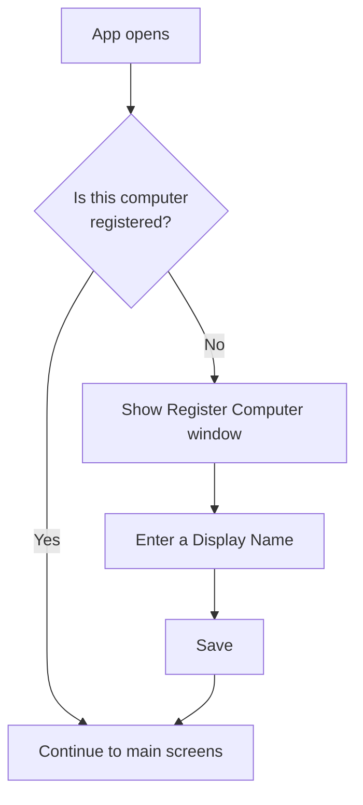
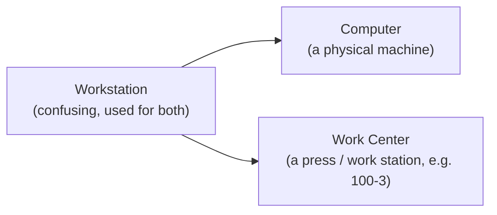
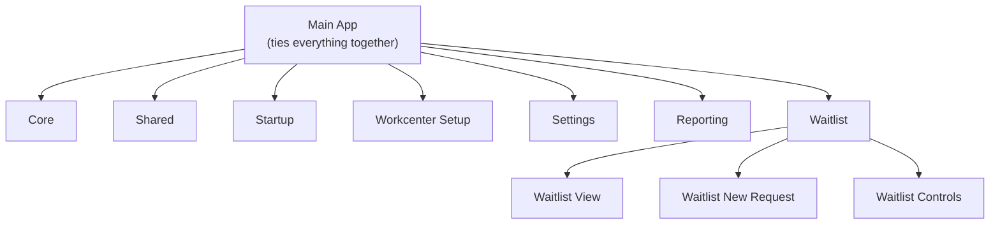

# MTM Waitlist — End-User Changelog

> **Audience:** End users / plant-floor operators, supervisors, and admins.
> This changelog covers **user-facing** changes primarily — what you can see and do differently
> in the app. Implementation details and internal plumbing are mostly excluded, but the module
> restructuring below is included because it affects how the app is built and maintained going
> forward.
>
> **Date:** 2026-08-29

---

## What's new for you

### 1. Computer registration on first launch (First-Load Gate)

**What changed:** The first time the app is used on a new or unregistered computer, it now
stops and asks you to register that computer (give it a friendly Display Name like
"John's Computer" and an optional description) before you can get into the main screens.
The computer name and MAC address are detected automatically and shown to you.

**Why it matters:** This gives each physical machine a stable, human-readable identity
that follows it across restarts, sessions, and even renames. It is the foundation for
remembering each computer's own "Local Work Centers" list and settings, so your setup
doesn't get mixed up with someone else's machine.

**Time spent:** ~1 hr (part of the overall computer-identity work below)

---

### 2. Computers management in Settings

**What changed:** A new **Computers** panel under **Settings → Operations**. Admins and
Developers can now view every registered computer (Display Name, Computer Name, MAC
address), add new ones, edit details, and delete ones that are no longer used.

**Why it matters:** You no longer have to touch the database to manage which computers are
known to the system. Keeping the list clean means only real machines show up in pickers
and that retired computers don't clutter the registry.

**Time spent:** ~1.5 hrs

---

### 3. You can't accidentally delete the computer you're currently using

**What changed:** In the Computers panel, the **Delete** button is hidden for the computer
the app is currently running on.

**Why it matters:** Deleting your own machine mid-session would break your current session
and force you to re-register. Removing that button for the active computer prevents an
accidental, hard-to-recover mistake.

**Time spent:** ~20 min

---

### 4. Clearer computer naming everywhere ("Display Name - Computer Name")

**What changed:** Wherever a computer is shown to you (for example, the Local Work Centers
picker), it now appears as **"Display Name - Computer Name"** (e.g. *John's Computer - johnspc*)
instead of a raw, cryptic hostname.

**Why it matters:** Friendly, consistent labels make it obvious *which* machine you're
looking at or selecting, reducing confusion on a shop floor with many computers.

**Time spent:** ~40 min

---

### 5. Terminology cleanup: "Workstation" → "Computer" / "Work Center"

**What changed:** The app no longer uses the confusing, over-loaded word "Workstation".
It is now consistently either **Computer** (a physical machine) or **Work Center** (a press /
work station like `100-3`). User-facing labels, screens, and messages were updated.

**Why it matters:** Two very different things used to share one name. Separating them into
"Computer" and "Work Center" removes ambiguity so operators and admins are always clear
whether they're talking about a physical PC or a press.

**Time spent:** ~45 min (ongoing — internal code cleanup continues)

---

### 6. Reliability fixes (things you might not see, but you'll feel)

**What changed:**

- The Register Computer window now correctly shows the detected computer name and MAC
  address (previously these could appear blank).
- If you close the app partway through the registration screen, the app will correctly ask
  you to register again next time — it will no longer quietly skip the step.

**Why it matters:** These fixes make the new registration flow dependable and predictable,
so the computer-identity system always behaves the same way every launch.

**Time spent:** ~1 hr

---

### 7. App restructured into separate module projects

**What changed:** The app was reorganized from one large project into several smaller,
focused module projects (Core, Shared, Startup, Workcenter Setup, Settings, Reporting), with
the Waitlist area itself split into three focused sub-projects (View, New Request, Controls). Each
feature area now builds as its own library, with the main app tying them together.

**Why it matters:** This is mostly behind the scenes, but it makes the app easier to maintain
and safer to update. Because each area is separated, a change to one part of the app is less
likely to accidentally affect another. It also lets us build, test, and release each area
more independently, which means more reliable updates and faster fixes over time.

**Time spent:** ~2 hrs (ongoing — this was a large structural change)

---

## Total time worked on this repo (today)

Per WakaTime, **2026-08-29** — **MTM Waitlist** repo total:

- **5 hours 30 minutes** of active coding time
- Session window: **12:45 PM → 10:45 PM** (935 tracked heartbeats)
- (The 5 hr 30 min figure is specifically *this repo*; other projects/`rules` are not included.)

> WakaTime reports rounded figures from the dashboard API (rounded to the nearest 15 minutes
> and shown in 12-hour AM/PM format). Individual feature times above are estimates drawn from
> the same session; the repo total is the verified/aggregated number.

---

## Glossary

- **Repo** — Short for "repository": the single source-code project (and its version history)
  that contains all of the MTM Waitlist code.
- **Project** — A buildable unit of code in the repo. The app is now made up of several
  projects rather than one.
- **Library** — A project that is built as a reusable, self-contained package of code that
  other projects can reference. Each module (Core, Settings, etc.) is now its own library.
- **Main App** — The main project that ties all the module libraries together and launches
  the application.
- **Module** — A named feature area of the app (e.g. Core, Startup, Settings, Waitlist).
  Each module is now its own project/library.
- **View** — A screen or page of the UI. For example, "Waitlist View" is the main waitlist
  screen.
- **Controls** — Reusable UI building blocks (buttons, cards, list items) that are shared
  across screens. "Waitlist Controls" is the library holding those shared pieces.
- **Heartbeat** — A single time-stamped record of activity tracked by WakaTime. The number of
  heartbeats gives a rough sense of how much time was spent working in the repo.
- **WakaTime** — A tool that tracks how much time is spent coding in each project and reports
  it (for example, the total time worked on this repo shown in this changelog).
