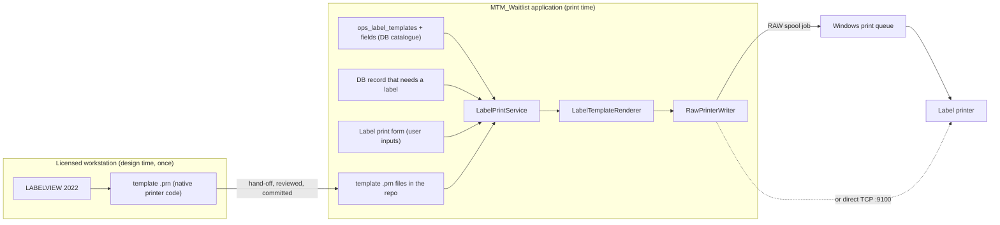

# LABELVIEW 2022 → MTM_Waitlist Label Printing Integration

**Status:** implementation groundwork — nothing built yet.
**Author:** research pass, 2026-09-22.
**Audience:** whoever implements label printing in this repo, and whoever administers the licensed
LABELVIEW workstation.

---

## 1. What this document is

The goal stated for this work was:

> Print labels for LABELVIEW 2022 from our own self-hosted application. Do **not** open the LABELVIEW
> application. Do **not** invoke the LABELVIEW licence. Either print what the database says the label
> needs, or let the user enter the inputs the label uses, then print.

This document records what the vendor actually supports (section 3), picks the one route that satisfies
all three constraints (section 4), and gives a phased implementation plan with acceptance checks
(section 5). Appendices carry the design-time hand-off procedure, the licence-bearing alternatives, the
approaches that were investigated and rejected, and the sources.

### Hard constraint on this workstation

**LABELVIEW is not installed on this machine.** Consequences, stated up front so no phase is planned
around a capability that is not here:

- The design-time step (Appendix A) **cannot** be performed or verified here. It must happen on a
  workstation where LABELVIEW 2022 is installed and activated, by someone who holds that licence.
- No label template file (`.prn` / printer code) exists in this repository yet. Phase 1 produces it.
- No end-to-end print can be proven until a real label printer is reachable from a machine running this
  application (Phase 8). Unit tests can prove rendering, validation and command framing; they cannot
  prove print output.

---

## 2. Decision summary

| | Route | Opens LABELVIEW? | Invokes a TEKLYNX licence at print time? | Verdict |
|---|---|---|---|---|
| **A** | **Printer-code template + raw print from our app** | No | **No** | **Chosen** |
| B | SENTINEL REST API / CODESOFT API Printer / TEKLYNX SDK | No | **Yes** — licence-bearing by design | Documented as the fallback if A cannot meet a requirement |
| C | Touch2Print / Click Print / LABELVIEW print dialog | Yes (or its print UI) | Yes | Rejected |

**Route A in one sentence:** LABELVIEW is used once, at design time, to *produce the printer code*; the
application then stores that code as a template with `{{Token}}` placeholders, fills the placeholders
from the database (or from a form the user fills in), and writes the finished bytes to the printer
itself. No TEKLYNX product runs when a label is printed, so no TEKLYNX licence is involved in printing.

TEKLYNX's own knowledge base describes this shape of solution: a label is designed and exported as
native printer code, and thereafter "labels can be printed **without a labeling software program**, and
can be printed from applications that run on platforms other than Windows" (KA-02370, *What is a Print
Object File*, listed in Appendix F). The same article warns it "is not an on-the-fly solution" — see
Appendix E.

---

## 3. What the vendor actually supports (verified 2026-09-22)

### 3.1 LABELVIEW 2022 has no documented headless or API print path

- The LABELVIEW product page publishes, for 2022, only: Brochure, OS Compatibility, Dongle Compatibility,
  **Administrator's Guide**, **Installation Scenarios**, **Tutorial**, **User Guide**. The supplementary
  guides (Database Manager, Form Designer, **Form Viewer**, **Touch2Print**) are published for 2025 only.
  There is no developer, API, SDK, automation or integration guide for LABELVIEW at all.
- The LABELVIEW 2022 **Administrator's Guide was downloaded and text-extracted** during this pass
  (34 pages / ~34k characters). It contains **zero** occurrences of *command line*, *ActiveX*, *OLE*,
  *automation*, *print server*, *SENTINEL*, *POF*, *Print Object File*, *printer code*, *Touch2Print* or
  *Click Print*. Its 128 occurrences of "licence/license" are all deployment: Network License Manager,
  dongle, activation, licence types.

  This is a strong negative result: **the one 2022 administrator document that exists is about
  licensing and deployment, not about programmatic printing.**

### 3.2 Every programmatic print route TEKLYNX sells today is CODESOFT-based

From TEKLYNX's own API label printing page:

| Vendor offering | Mechanism | Licensing | LABELVIEW named? |
|---|---|---|---|
| **SENTINEL + REST API** | Server middleware "watches for data, processes it, and triggers print jobs to specified printers"; accepts "a wide variety of data inputs, including REST API requests"; returns print-job status and errors to the caller | SENTINEL licence | No |
| **CODESOFT + API Printer add-ons** | "send print jobs using .NET or legacy ActiveX", "priced per printer"; trial includes two API printers; CODESOFT 2022 and later includes one API printer | CODESOFT **Enterprise subscription** licences | No |
| **TEKLYNX SDK** | ".NET and REST API libraries, documentation, sample applications"; aimed at software publishers embedding printing | SDK licence | No |

The same page states plainly: "TEKLYNX label printing APIs **leverage the foundation of CODESOFT** to
print labels." LABELVIEW appears in none of the three options. Development samples for the .NET /
ActiveX path ship with CODESOFT under
`C:\Users\Public\Documents\Teklynx\CODESOFT\Samples\Integration`.

### 3.3 Anything that renders through TEKLYNX is metered (2025 and later)

KB **KA-02594** — *Electronic Document Licensing* — applies to **CODESOFT and LABELVIEW**, 2025 and
later, and defines a quota for "Electronic Outputs" licences: **5,000 licence units per API printer per
consecutive 7-day window**, where one unit is one label generated. It is triggered by:

- printing via Windows drivers that produce a document format (PDF, XPS, image formats, …);
- printing to any port that captures the printout electronically (`FILE:`, prompt-for-file, fixed file);
- exporting the document to PDF or image formats.

**Every output that is not a physical printer is metered.** A design that round-trips labels through a
PDF or a file port to avoid a licence will run into this quota at scale.

### 3.4 Operator-facing features that look like they fit, but do not

| Feature | Why it does not satisfy the requirement |
|---|---|
| **Touch2Print** (2021+, LABELVIEW and CODESOFT) | Touch-screen label picker with data entry — good shape — but the vendor states: "You will need a working label designer application on the workstation to run Touch2Print." It is a licensed-application feature, not a headless one. |
| **Click Print** (LABELVIEW and CODESOFT) | Shows label previews from a folder; clicking **Print** opens the standard print dialog (with `WhenPrinted` variables and database record selection). It is a shortcut into the application's print UI. |
| **LABELVIEW print dialog, `Direct` format** | Prints a single label "directly, without displaying the print dialog box" — but it is still the running application doing it. |
| **LABELVIEW `WhenPrinted` variables / Form** | Prompts the operator for values at print time — inside the application. Useful as the *behaviour* to imitate, not as the mechanism. |
| **Command File Interpreter (CFI), Print Object File (POF)** | Powerful headless routes, but **CODESOFT** features. POF is documented as "only available [with] CODESOFT Enterprise Single User licenses". |
| **LABELVIEW ActiveX / OLE automation** | Not documented anywhere by the vendor for 2022 (it is absent from the 2022 Administrator's Guide). Community posts describe an `LabelManager2` / TK Labeling ActiveX for older Gold builds, and every such route loads licensed TEKLYNX components anyway. Do not build on it. |

---

## 4. Route A — the implementation

### 4.1 Why this satisfies all three constraints

| Constraint | How Route A satisfies it |
|---|---|
| Do not open the LABELVIEW application | LABELVIEW is only ever opened at design time, by a human, on the licensed workstation, to author and export the template. It is not installed on the printing machines. |
| Do not invoke the LABELVIEW licence | No TEKLYNX binary, service or component is loaded at print time. The application writes printer bytes to the printer. The vendor's own wording for this pattern is that labels "can be printed without a labeling software program". |
| Print from the database, or from user-entered inputs | Template field values come from either (a) the database record that triggered the print, or (b) a form generated from the template's declared fields. |

### 4.2 Architecture



### 4.3 Project layout

Follows the repository's existing shape (one library per concern; XAML views stay in the app).

| Path | Contents |
|---|---|
| `MTM_Waitlist.Printing/` | New class library: models, template store, renderer, raw writer, print service |
| `MTM_Waitlist.Printing/LabelPrintService.cs` | The seam the rest of the app calls |
| `MTM_Waitlist.Printing/RawPrinterWriter.cs` | Win32 `RAW` spool write and direct-port write |
| `MTM_Waitlist.Printing/LabelTemplateRenderer.cs` | Token substitution and validation |
| `MTM_Waitlist.Printing/LabelTemplateStore.cs` | Loads template bodies from disk, metadata from DB |
| `MTM_Waitlist.Printing/ViewModels/LabelPrintViewModel.cs` | Manual (operator-entry) print flow |
| `Module_Printing/Views/LabelPrintView.xaml` | The form, in the app project (`XxxView` suffix per naming rules) |
| `Labels/<template_key>/v<N>.prn` | Template bodies, in the repository, reviewable in git |
| `Database/**` | Three tables and four procedures in the store that owns the label |
| `MTM_Waitlist.Tests/Module_Printing/` | New test folder (`Module_<Area>` convention) |

Which database? Labels for the receiving application belong to **`mtm_receiving_application`**; dunnage
and work-center labels belong to **`mtm_waitlist`**. Put the tables in the owning store — do not
duplicate the catalogue across stores.

### 4.4 Schema (MySQL 5.7, `Database/` layout, names per the locked SQL ruleset)

Three tables. Names follow `{category}_{table}_{action_or_purpose}`, primary key `id`, public UUID
`public_id`, `is_`/`has_` booleans, `_utc` timestamps. Note `display_sequence` rather than any
`..._order` name — a bare `order` identifier is banned by the ruleset.

```
Tables/ops_label_templates/
Tables/ops_label_template_fields/
Tables/ops_label_print_logs/
```

| `ops_label_templates` | Purpose |
|---|---|
| `id` BIGINT AUTO_INCREMENT PK | internal id |
| `public_id` CHAR(36) | public UUID |
| `template_key` VARCHAR(64) | stable key, unique (`uq_ops_label_templates_template_key`) |
| `label_name` VARCHAR(128) | human name shown to the operator |
| `template_relative_path` VARCHAR(255) | e.g. `part_label/v1.prn` under the `Labels/` root |
| `printer_name` VARCHAR(128) | Windows queue name, or `tcp://host:9100` for direct |
| `printer_dialect` VARCHAR(16) | `zpl`, `ipl`, `epl`, … — must match the template |
| `printer_dpi` SMALLINT | 203 / 300 / 600 — must match the template |
| `has_counter` TINYINT(1) | template contains a serialised field |
| `is_active` TINYINT(1) | soft enable; **no** delete (history tables carry audit, hard delete only for the primary entity) |
| `created_utc`, `updated_utc` DATETIME | UTC |

| `ops_label_template_fields` | Purpose |
|---|---|
| `id`, `public_id` | as above |
| `template_id` BIGINT FK | `fk_ops_label_template_fields_ops_label_templates_template_id` |
| `field_token` VARCHAR(64) | the literal token inside `{{ }}` |
| `field_label` VARCHAR(128) | caption on the operator form |
| `value_type` VARCHAR(16) | approved key-value column name; `text` \| `barcode` \| `date` \| `counter` \| `quantity` |
| `is_required` TINYINT(1) | form validation |
| `max_length` SMALLINT | validation cap |
| `default_value` VARCHAR(255) | prefilled value, nullable |
| `display_sequence` SMALLINT | form order |
| unique | `uq_ops_label_template_fields_template_id_field_token` |

| `ops_label_print_logs` | Purpose |
|---|---|
| `id`, `public_id` | as above |
| `template_id` BIGINT FK | which template |
| `printer_name` VARCHAR(128) | where it was sent |
| `source_kind` VARCHAR(16) | `automatic` \| `operator` |
| `source_reference` VARCHAR(128) | the triggering record's public id, or the operator's session id |
| `printed_by_user_id` BIGINT | nullable for fully automatic prints |
| `payload_hash` CHAR(64) | SHA-256 of the rendered bytes — proves *what* was printed without storing it |
| `is_success` TINYINT(1) | outcome |
| `error_text` VARCHAR(512) | null on success |
| `copies` SMALLINT | labels requested |
| `printed_utc` DATETIME | UTC |

Procedures (one folder each under `StoredProcedures/`, each with `create.sql` + `rollback.sql`):

| Procedure | Contract |
|---|---|
| `sp_label_template_get` | `(template_key)` → template row + its field rows |
| `sp_label_template_list` | `(is_active_only)` → rows for the picker |
| `sp_label_print_log_insert` | `(…)` → affected-row count via the non-query seam |
| `sp_label_print_log_get` | `(template_key, from_utc, to_utc, max_rows)` → recent attempts |

Rules that must be satisfied in the same change (they are enforced, not stylistic):

- **No inline SQL in application code.** Every data operation goes through a stored procedure;
  `InlineSqlAuditTests` fails the build otherwise.
- Every schema artifact ships `create.sql` **and** `rollback.sql`.
- Any SQL added or changed under `Database/` must update
  `Database/Bootstrap/update_table_descriptions.sql` in the same change.
- A reprint is a **new** log row, never an update of an old one.

### 4.5 The print seam

```csharp
namespace MTM_Waitlist.Printing;

public interface ILabelPrintService
{
    Task<LabelPrintResult> PrintAsync(LabelPrintRequest request, CancellationToken cancellationToken);
    Task<IReadOnlyList<LabelTemplateSummary>> GetTemplatesAsync(CancellationToken cancellationToken);
    Task<IReadOnlyList<LabelTemplateField>> GetFieldsAsync(string templateKey, CancellationToken cancellationToken);
}

public sealed record LabelPrintRequest(
    string TemplateKey,
    LabelPrintSourceKind SourceKind,
    string? SourceReference,
    long? PrintedByUserId,
    short Copies,
    IReadOnlyDictionary<string, string> FieldValues);
```

`LabelPrintService` orchestrates: load catalogue row via `sp_label_template_get` → load template body
from `LabelTemplateStore` → validate dialect/DPI against the configured printer →
`LabelTemplateRenderer` → `RawPrinterWriter` → `sp_label_print_log_insert`. It never throws at the
caller for a printer problem; it returns a `LabelPrintResult` carrying success, the job id where one
exists, and a message, and it records the attempt either way.

### 4.6 The raw writer

Two mechanisms, both grounded in Microsoft's own documentation.

**Primary — Win32 `RAW` spool job.** Microsoft documents the job sequence as `StartDocPrinter` →
`StartPagePrinter` → `WritePrinter` → `EndPagePrinter` → `EndDocPrinter`, with `StartDocPrinter`
called at level 1 with a `DOC_INFO_1` whose `pDatatype` is `"RAW"`. Microsoft's note on `RAW` is the
important one for this design: documents written this way "**must fully describe the DEVMODE-style print
job settings in the language understood by the hardware**" — i.e. the template bytes are the whole job,
which is exactly what a LABELVIEW-exported printer file already is.

```csharp
using System.Runtime.InteropServices;
using Microsoft.Win32.SafeHandles;

namespace MTM_Waitlist.Printing;

internal sealed partial class RawPrinterWriter
{
    [StructLayout(LayoutKind.Sequential, CharSet = CharSet.Unicode)]
    private sealed class DocInfo1
    {
        [MarshalAs(UnmanagedType.LPWStr)] public string? DocumentName;
        [MarshalAs(UnmanagedType.LPWStr)] public string? OutputFile;
        [MarshalAs(UnmanagedType.LPWStr)] public string? DataType;
    }

    [DllImport("winspool.drv", EntryPoint = "OpenPrinterW", SetLastError = true, CharSet = CharSet.Unicode)]
    private static extern bool OpenPrinter(string printerName, out IntPtr printerHandle, IntPtr defaults);

    [DllImport("winspool.drv", EntryPoint = "StartDocPrinterW", SetLastError = true, CharSet = CharSet.Unicode)]
    private static extern int StartDocPrinter(IntPtr printerHandle, int level, [In] DocInfo1 docInfo);

    [DllImport("winspool.drv", SetLastError = true)]
    private static extern bool StartPagePrinter(IntPtr printerHandle);

    [DllImport("winspool.drv", SetLastError = true)]
    private static extern bool WritePrinter(IntPtr printerHandle, IntPtr buffer, int byteCount, out int written);

    [DllImport("winspool.drv", SetLastError = true)]
    private static extern bool EndPagePrinter(IntPtr printerHandle);

    [DllImport("winspool.drv", SetLastError = true)]
    private static extern bool EndDocPrinter(IntPtr printerHandle);

    [DllImport("winspool.drv", SetLastError = true)]
    private static extern bool ClosePrinter(IntPtr printerHandle);

    // Call from a background thread only. Microsoft documents WritePrinter as blocking, and warns that
    // calling it on a thread that manages UI interaction can make the application appear unresponsive.
    public int WriteRaw(string printerName, string jobName, byte[] payload)
    {
        if (!OpenPrinter(printerName, out var printerHandle, IntPtr.Zero))
        {
            throw new LabelPrintException(printerName, "OpenPrinter failed.", Marshal.GetLastWin32Error());
        }

        try
        {
            var docInfo = new DocInfo1
            {
                DocumentName = jobName,
                OutputFile = null,      // null = spool to the printer, not to a file
                DataType = "RAW",       // the payload is already the printer language
            };

            if (StartDocPrinter(printerHandle, 1, docInfo) == 0)
            {
                throw new LabelPrintException(printerName, "StartDocPrinter failed.", Marshal.GetLastWin32Error());
            }

            try
            {
                if (!StartPagePrinter(printerHandle))
                {
                    throw new LabelPrintException(printerName, "StartPagePrinter failed.", Marshal.GetLastWin32Error());
                }

                try
                {
                    var buffer = Marshal.AllocCoTaskMem(payload.Length);
                    try
                    {
                        Marshal.Copy(payload, 0, buffer, payload.Length);
                        if (!WritePrinter(printerHandle, buffer, payload.Length, out var written) || written != payload.Length)
                        {
                            throw new LabelPrintException(printerName, "WritePrinter failed.", Marshal.GetLastWin32Error());
                        }
                    }
                    finally
                    {
                        Marshal.FreeCoTaskMem(buffer);
                    }
                }
                finally
                {
                    EndPagePrinter(printerHandle);
                }
            }
            finally
            {
                EndDocPrinter(printerHandle);
            }
        }
        finally
        {
            ClosePrinter(printerHandle);
        }

        return payload.Length;
    }
}
```

**Secondary — `PrintQueue.AddJob` + `JobStream`.** Microsoft documents `AddJob(jobName)` as inserting a
print job "whose content is a byte array" and states it is for writing "device specific information, to
a spool file, that is not automatically included by the Windows spooler". The payload is written to
`PrintSystemJobInfo.JobStream` and **must** be closed before the calling thread ends, or an
`InvalidOperationException` is thrown. This route needs WPF's `System.Printing` and, for the
XPS-document overloads, an STA thread (Microsoft notes `fastCopy: false` on a non-XPSDrv printer calls
COM and therefore requires an STA thread). Prefer the Win32 path in a service or background context.

**Third (only if required) — direct TCP to port 9100.** Skips the spooler entirely. The trade-off is
documented by a TEKLYNX integrator's reference article: without the Windows print subsystem, "print jobs
sent over the network are not managed", so a job can be corrupted or silently lost, and the vendor
recommends its Test Connection button because there are no Windows messages or logs to troubleshoot
with. Use this only where the spooler is genuinely unusable, and log aggressively.

### 4.7 Template contract and rendering rules

Token syntax is `{{field_token}}`. It cannot collide with printer command syntax (ZPL uses `^` and `~`;
`{{` does not occur in either). A template header of the form below is *not* read from the `.prn`; the
manifest is the database, so the file stays exactly what the printer needs:

```text
^XA
^FO50,40^A0N,34,34^FD{{part_number}}^FS
^FO50,90^BY2^BCN,90,Y,N,N^FD{{serial_number}}^FS
^FO50,200^A0N,26,26^FD{{quantity}}{{unit_of_measure}}^FS
^FO50,240^A0N,22,22^FD{{printed_on}}^FS
^XZ
```

Rules the renderer enforces — all of them fail closed:

1. **Unknown or missing token → refuse to print.** After substitution, if any `{{` remains, throw. A
   label with `{{part_number}}` printed literally on it is worse than no label.
2. **Supplied values not declared in the catalogue → refuse.** The catalogue is the contract.
3. **Barcode values are validated against a strict allow-list** before substitution (printable ASCII,
   no control characters, and specifically no `^` or `~`). A value copied from a database field or typed
   by an operator is inserted **into a printer command stream**; a stray `^` rewrites the command
   stream. This is command injection aimed at a printer, and it must be blocked at the token boundary,
   not trusted.
4. **Length caps** from `max_length`, enforced before substitution.
5. **Dialect and DPI must match** between template row and target printer row; mismatch → refuse with a
   clear message rather than printing something mis-scaled.
6. `printed_on` / date fields are formatted in the invariant `yyyy-MM-dd` form and, if the label shows
   local time, the time zone is applied once, in the service, never in the template.
7. Counters are resolved **before** rendering and written to the log row, so a reprint is traceable.

### 4.8 Entry points

**Automatic (database-driven).** The caller already holds the record. Example for a receiving part
label: the receiving transaction commits, then the service is invoked with `part_number`,
`serial_number`, `quantity` and `unit_of_measure` taken from the rows just written. The triggering
record's public id goes into `source_reference`. Print failures never roll back the transaction — the
label attempt is its own logged outcome, surfaced to the operator with a retry.

**Manual (operator-entered).** `LabelPrintView` is generated from `ops_label_template_fields`:
one input per field, ordered by `display_sequence`, required fields enforced, `value_type` choosing the
control (plain text, barcode entry with a scan-friendly focus order, date picker, numeric quantity).
The operator picks a template from `sp_label_template_list`, fills the form, chooses copies, and presses
Print. This is the behaviour the requirement asked for — "have the user enter the inputs the label uses
to print" — without LABELVIEW's print dialog.

Neither entry point is a new navigation destination until the catalogue has at least one active
template; the view reports "no labels are configured" rather than rendering an empty form.

### 4.9 Settings

Settings are data, not constants: read through `config_settings_values` and edited in the Settings
module like every other setting.

| Proposed key | Meaning |
|---|---|
| `printing.labels.template_folder` | Root that `template_relative_path` is resolved against; default is the deployed `Labels/` folder |
| `printing.labels.default_printer` | Fallback queue when a template row leaves `printer_name` empty |
| `printing.labels.max_copies` | Hard cap on copies per print request |
| `printing.labels.attempt_history_days` | Retention for `ops_label_print_logs`, enforced by the retention job |

### 4.10 Failure behaviour

The label feature follows the repository's existing rule for an unavailable internal store: show a
per-screen unavailable state (`Store` / `LastAttemptUtc` / `RetryCount` / `NextRetryUtc` plus a manual
retry), never a substitute for real data and never a permanent banner. A print that fails is a logged
row with `is_success = 0` and `error_text`, plus an operator-visible retry. Because the payload hash is
stored, "was this label printed twice?" is answerable without keeping label contents.

---

## 5. Implementation phases

Each phase lists its acceptance check. The repository's verification rule applies throughout: a phase is
complete only when the solution builds with **0 warnings, 0 errors** and the test suite reports
**Failed: 0** — not when the code looks right.

### Phase 0 — Decisions and prerequisites

- Identify the label printers: make, model, resolution (203/300/600 dpi), and the command language they
  accept. TEKLYNX's own drivers emit ZPL / IPL / etc. for Zebra, Sato, DataMax, Intermec and others;
  this design targets the same native languages.
- Decide the print transport per printer: Windows queue (preferred) or direct TCP 9100.
- Identify which labels are in scope (receiving part labels, dunnage / work-center setup labels, or
  both) and, for each, which fields vary.
- Identify the licensed workstation that will produce the templates, and the person who operates it.

**Acceptance:** a written list of printers (with resolution), in-scope labels, and the named design-time
owner.

### Phase 1 — Design-time hand-off (Appendix A)

Performed on the LABELVIEW workstation, not here. Produces: one `.prn` per label, the field manifest,
and a correctly printed sample as ground truth.

**Acceptance:** for each label, a `.prn` file whose placeholders cover every variable, a token list that
matches the database columns, and a photograph or PDF of a correct print to compare against later.

### Phase 2 — Schema and procedures

Three tables, four procedures, paired `create.sql` / `rollback.sql`, plus the mandatory
`update_table_descriptions.sql` update, in the owning store.

**Acceptance:** scripts run clean on a fresh dev database; rollback scripts undo them; the SQL naming
guard passes; `InlineSqlAuditTests` still passes.

### Phase 3 — `MTM_Waitlist.Printing`

Models, `LabelTemplateStore`, `LabelTemplateRenderer`, `RawPrinterWriter`, `LabelPrintService`, and the
`LabelPrintException` type. Token rendering and all seven validation rules from section 4.7.

**Acceptance:** rendering a template with a full field set produces byte-identical output to the sample
`prn` with the sample values inlined; every refusal rule in 4.7 has a test that proves it refuses.

### Phase 4 — Composition and settings

Register the service and its dependencies in the app's DI host; add the four settings keys; read the
`Labels/` root from settings; ensure the template folder is deployed with the app.

**Acceptance:** the app starts with the feature registered and, with no catalogue rows, reports
"no labels are configured" without throwing.

### Phase 5 — Entry points

Automatic print after the triggering transaction; the operator form generated from the catalogue.

**Acceptance:** an operator with no label knowledge can print a correct label after reading only the
form captions; an automatic print produces a log row referencing the triggering record.

### Phase 6 — Attempt history and failure surfacing

`sp_label_print_log_insert` on every attempt, success or failure; the unavailable-state pattern for a
store that is down; retention by setting.

**Acceptance:** a print against a switched-off printer produces a failure row, an operator-visible
message, and no unhandled exception.

### Phase 7 — Tests (`MTM_Waitlist.Tests/Module_Printing/`)

MSTest 3.7.0, no mocking library — hand-written fakes only, `Module_<Area>` folder, and the
`<Method>_<Scenario>_<Expectation>` naming rule. Cover: token rendering; each refusal rule; length and
character validation (including a value containing `^` and a value containing `~`, which must be
refused); DPI/dialect mismatch; copies cap; hash stability; the view model's validation and command
state. Add a fake writer so no test touches a real printer.

**Acceptance:** suite reports Failed: 0, and each refusal test was first observed failing against the
unguarded implementation.

### Phase 8 — End-to-end verification on real hardware

Print each in-scope label to its real printer and compare against the design-time ground truth from
Phase 1: barcode content and symbology, field placement, label gap, and print darkness. Scan every
barcode with the same scanner the plant uses.

**Acceptance:** every label matches its ground-truth sample and every barcode scans.

### Phase 9 — Spec-kit

If this is to be built rather than documented, the repository's spec-first rule applies: run
`/speckit.specify` → `clarify` → `plan` → `tasks` → `analyze` → `implement` for a feature like
`NNN-label-print-integration`, and let this document be the technical input. Do not jump straight to
code for work of this size.

---

## Appendix A — Design-time hand-off procedure

To be performed by a person on a workstation where LABELVIEW 2022 is installed and activated. Print this
appendix and give it to them.

1. **Confirm the target printer.** In LABELVIEW, the printer must be a printer-resident (native driver)
   printer so the output is raw printer code rather than a Windows-driver rendering. Check the Port
   column — TEKLYNX Direct Print printers are marked with an arrow before the port name. Record the
   printer model, resolution and language.
2. **Design the label with every variable field present.** For each variable, note the intended source:
   a database column, or an operator entry.
3. **Produce the printer code.** Use **File → Print → Print to a File** and save the output. (The
   knowledge base article *How can I view the Printer Code without printing to a File?* gives the
   alternative for inspecting the code directly.)
4. **Print one real sample** with real values. Keep it — it is the ground truth every later verification
   is compared against. Photograph it or save it as PDF **for reference only**; do not use the PDF as the
   production path (see the metering note in section 3.3).
5. **Hand back four things, per label:**
   1. the `.prn` printer-code file;
   2. the list of variable fields, with a proposed `{{token}}` name for each and its source (column or
      operator entry);
   3. the printer name, resolution and language;
   4. the ground-truth sample.
6. **Note anything unusual:** counters, date fields, `WhenPrinted` variables, printer commands
   (job modifiers) already embedded in the code, and whether the label needs a specific stock or gap
   setting.

Warnings to pass on:

- Keep the LABELVIEW source label (`.lbl`) under version control too. The `.prn` and the `.lbl` will
  drift apart otherwise, and re-exporting must be a deliberate, reviewed act — the new `.prn` gets
  diffed against the old one before it is committed.
- Do not "improve" the emitted code by hand where the design can be changed instead; hand edits are lost
  the next time the label is re-exported.

## Appendix B — Route B: the licence-bearing alternatives, if Route A cannot meet a requirement

Route A cannot resolve label layout at print time. The moment a requirement needs TEKLYNX to compute the
job — complex conditional object visibility, printer-resident barcode fonts chosen at run time, per-job
printer commands the template cannot express — one of these is required, and every one of them involves
TEKLYNX licensing.

| Option | Fits when | Cost shape |
|---|---|---|
| **SENTINEL + REST API** | Printing must be triggered centrally from a self-hosted service, the label and printer must be chosen by rules, and the caller needs a job status back. SENTINEL accepts "a wide variety of data inputs, including REST API requests" and returns "details about the print job, including its status and any errors". Best fit for "print what the database says". | SENTINEL licence |
| **CODESOFT + API Printer add-ons** | Printing from multiple workstations with non-networked printers. .NET or legacy ActiveX. | Priced per printer; requires CODESOFT **Enterprise subscription** licences |
| **TEKLYNX SDK** | This is being turned into a product other companies install. .NET and REST libraries plus samples. | SDK licence |

Two facts to weigh before choosing B:

- TEKLYNX's current automation stack is **CODESOFT-based**. If the organisation owns LABELVIEW rather
  than CODESOFT, buying into B means buying CODESOFT licensing as well.
- **Any** of these routes is metered for electronic outputs from 2025 onward (section 3.3). A route that
  produces PDFs or writes to a file port will hit the 5,000-labels-per-API-printer-per-7-days quota.

## Appendix C — Approaches investigated and rejected (recorded so they are not re-attempted)

| Approach | Why not |
|---|---|
| Command-line printing with LABELVIEW | Not documented for 2022. The 2022 Administrator's Guide contains no command-line content at all. |
| LABELVIEW OLE automation / ActiveX (`LabelManager2`, TK Labeling ActiveX) | Not documented by the vendor for 2022; community reports are for older Gold builds; and it loads licensed TEKLYNX components, which violates the licence constraint. |
| POF (Print Object File) | A CODESOFT Enterprise feature; explicitly "only available [with] CODESOFT Enterprise Single User licenses". |
| CFI (Command File Interpreter) | CODESOFT module, not LABELVIEW. |
| Touch2Print | Requires "a working label designer application on the workstation". Licensed, and it is an application UI. |
| Click Print | Convenience launcher into the application's own print dialog. |
| Windows-driver / PDF output as the production path | Metered under Electronic Document Licensing from 2025, and it makes the print path depend on third-party software being installed on every printing machine. |

## Appendix D — Licensing rules of thumb

- The **design** of a label is licensed; the **printer code a design emits** is not a licensed artifact.
  That is the whole basis of Route A.
- A physical printer is the safe output. PDFs, XPS, images and file ports are metered from 2025.
- Reprinting a label means generating another label — each one counts. In Route A that costs nothing;
  in Route B it consumes quota.
- LABELVIEW licences are per-workstation (dongle or software activation; network licences are multi-user
  licences managed by the Network License Manager). Nothing about Route A changes how those licences are
  counted, because Route A never runs the licensed software.

## Appendix E — Risks, non-goals, and open decisions

**Risks**

| Risk | Mitigation |
|---|---|
| Template is printer-specific. A template authored for one model/resolution mis-prints on another. | Store `printer_dialect` and `printer_dpi` on the template row and refuse to print on a mismatch. |
| The `.prn` template and the LABELVIEW `.lbl` source drift apart. | Both in version control; re-export is a reviewed change with a diff. |
| Printer-code templates bypass the driver's own sanity checks; a malformed template can waste stock. | Phase 8 compares against design-time ground truth before the label is released to operators. |
| Command injection into the printer stream from a database value or operator entry. | Strict allow-list and length validation at the token boundary; `^` and `~` refused in barcode and text values (section 4.7). |
| Direct TCP 9100 gives no delivery guarantee. | Prefer the spooler path; log every attempt; surface failures for retry. |
| Silent label loss is a compliance problem for part and shipment labels. | Every attempt is a row with a payload hash; the print history is queryable per triggering record. |

**Non-goals**

- No label *design* capability in the application. Labels are authored in LABELVIEW by a licensed user.
- No reimplementation of TEKLYNX barcode validation. Symbology correctness is a design-time concern
  verified in Phase 8 with the plant's own scanner.
- No demo or mock data path for label printing. The catalogue is live data; a store outage shows as an
  unavailable state, per the repository's standing rule.

**Open decisions**

1. Which printers are actually in scope, and are they reached by queue name or by IP?
2. Do any in-scope labels have counters that must be serialised across machines? If so, the counter has
   to be allocated from a single authority (a database row, not a file), and that is a design change in
   Phase 2.
3. Is the receiving-application catalogue authoritative for all labels, or do receiving and work-center
   labels get separate catalogues in their own stores?
4. Who owns re-exporting a template when a label changes, and what is the change-control path?

## Appendix F — Sources and verification status

Verified 2026-09-22. Two tooling facts are recorded because they shaped how the research was done:

- The **Microsoft Learn MCP server reported "currently disabled by the user"** in this session, so the
  Microsoft documentation below was retrieved by fetching the same Microsoft Learn pages directly. The
  repository's MCP-first rule requires the grounding, not a particular tool — and the content is
  identical.
- **Context7 has no entry for TEKLYNX, CODESOFT or LABELVIEW.** Two resolved searches returned no
  matching library, so no Context7 documentation exists for this product family. That is a coverage gap,
  not a lookup failure, and it is the reason the vendor knowledge base carries the weight here.

| Source | Used for |
|---|---|
| https://www.teklynx.com/en/products/label-design-solutions/labelview#productDocuments | The 2022 document set (no API/SDK/developer guide exists) |
| `LV2022_administrator_guide_en.pdf` (linked from the page above; downloaded and text-extracted) | Proof that 2022's administrator documentation covers licensing/deployment only |
| https://www.teklynx.com/en/learn-more/label-printing-api | SENTINEL REST, CODESOFT API Printer add-ons, TEKLYNX SDK; "leverage the foundation of CODESOFT" |
| https://www.teklynx.com/en/products/label-design-solutions/codesoft/development-tool-samples | .NET / ActiveX samples location; API printers per licence |
| https://www.teklynx.com/en/products/enterprise-label-management-solutions/sentinel/ | SENTINEL capabilities and data inputs |
| https://www.teklynx.com/en/products/teklynx-sdk | SDK scope (.NET + REST, for publishers) |
| KB **KA-02507** — Training Guide: Label Printing in LABELVIEW and CODESOFT | Print dialog, `Direct` format, `WhenPrinted` variables, log/test options |
| KB **KA-02431** — How to create a Printer Command File and print on a secondary machine? | The "print to a file, then send it to another machine" pattern |
| KB **KA-02370** — What is a Print Object File (POF)? | Printer code with placeholders for host substitution; POF is CODESOFT Enterprise only |
| KB **KA-02594** — What is Electronic Document Licensing? | 5,000 units per API printer per 7 days; PDF/file-port output is metered |
| KB **KA-02536** — What is Touch to Print? | Touch2Print requires a designer application on the workstation |
| KB **KA-01874** — How do I use Click Print? | Click Print opens the print dialog |
| KB **KA-02534**, **KA-01962**, **KA-02418**, **KA-02463**, **KA-02452** | Viewing printer code; importing ZPL; PDF output; default print method; print logs |
| EfficientBI reference article, *The Direct Print Method – TEKLYNX* | TEKLYNX drivers emit ZPL/IPL/etc.; bypassing the spooler loses job management; not all printers support it |
| https://learn.microsoft.com/en-us/windows/win32/printdocs/startdocprinter | `StartDocPrinter` job sequence, level 1, `DOC_INFO_1` |
| https://learn.microsoft.com/en-us/windows/win32/printdocs/writeprinter | `WritePrinter`; the `RAW` datatype must fully describe the job; the call blocks |
| https://learn.microsoft.com/en-us/dotnet/api/system.printing.printqueue.addjob | `AddJob` byte-array overload; job stream must be closed; STA requirement for the XPS-document overloads |

**Not verified — do not present as fact:**

- No LABELVIEW 2022 template has been produced or tested; the vendor's PDFs could not be parsed by the
  page-fetching tool and were read by downloading and extracting text instead (only the
  **Administrator's Guide** was read this way; the Installation Scenarios, Tutorial and User Guides were
  not).
- The exact LABELVIEW menu wording for the print-to-file step is taken from the knowledge base article,
  not observed on a 2022 installation.
- Whether a LABELVIEW-designed label's exported code is ZPL, IPL or another language on any particular
  printer has not been observed here — it depends on the driver chosen at design time.
- No code in this document has been compiled. The P/Invoke sample follows Microsoft's documented
  sequence and signatures; the service, store, renderer and view exist only as design.
