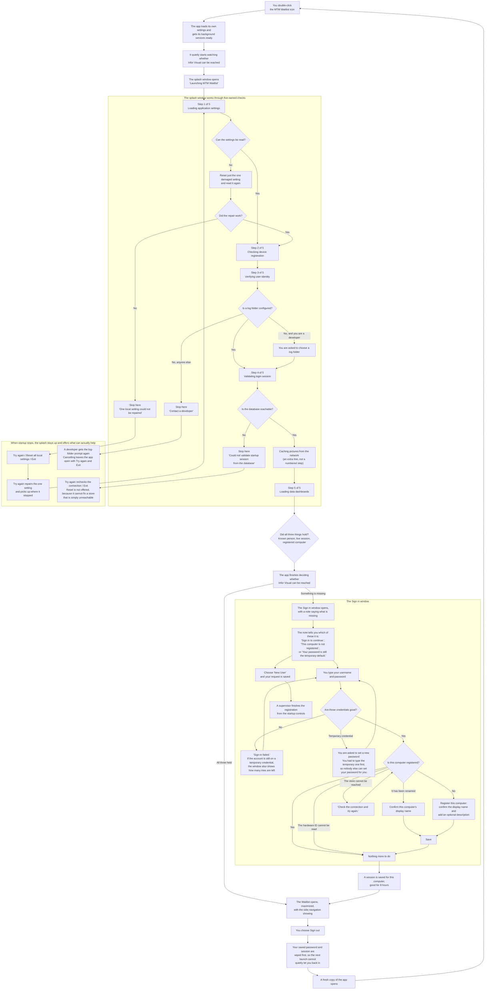

```mermaid
flowchart TD
    A["You double-click<br/>the MTM Waitlist icon"]

    A --> B["The app loads its own settings and<br/>gets its background services ready"]
    B --> C["It quietly starts watching whether<br/>Infor Visual can be reached"]
    C --> D["The splash window opens<br/>'Launching MTM Waitlist'"]

    subgraph SPLASH["The splash window works through five named checks"]
        direction TB
        S1["Step 1 of 5<br/>Loading application settings"]
        S1 --> Q1{"Can the settings be read?"}
        Q1 -->|"Yes"| S2
        Q1 -->|"No"| R1["Reset just the one damaged setting<br/>and read it again"]
        R1 --> Q1B{"Did the repair work?"}
        Q1B -->|"Yes"| S2
        Q1B -->|"No"| BLOCK_SETTINGS["Stop here<br/>'One local setting could not be repaired'"]

        S2["Step 2 of 5<br/>Checking device registration"]
        S2 --> S3["Step 3 of 5<br/>Verifying user identity"]
        S3 --> Q2{"Is a log folder configured?"}
        Q2 -->|"Yes"| S4
        Q2 -->|"No, and you are a developer"| PICK["You are asked to choose a log folder"]
        PICK --> S4
        Q2 -->|"No, anyone else"| BLOCK_LOGS["Stop here<br/>'Contact a developer'"]

        S4["Step 4 of 5<br/>Validating login session"]
        S4 --> Q3{"Is the database reachable?"}
        Q3 -->|"Yes"| PC["Caching pictures from the network<br/>(an extra line, not a numbered step)"]
        Q3 -->|"No"| BLOCK_DB["Stop here<br/>'Could not validate startup session<br/>from the database'"]
        PC --> S5["Step 5 of 5<br/>Loading data dashboards"]
    end

    subgraph BLOCKED["When startup stops, the splash stays up and offers what can actually help"]
        direction TB
        BLOCK_SETTINGS --> FIX_SETTINGS["Try again / Reset all local settings / Exit"]
        FIX_SETTINGS --> RETRY_SETTINGS["Try again repairs the one setting<br/>and picks up where it stopped"]
        RETRY_SETTINGS --> S1

        BLOCK_DB --> FIX_DB["Try again rechecks the connection / Exit<br/>Reset is not offered, because it cannot fix a store<br/>that is simply unreachable"]

        BLOCK_LOGS --> FIX_LOGS["A developer gets the log-folder prompt again<br/>Cancelling leaves the app open with Try again and Exit"]
    end

    subgraph SIGNIN["The Sign in window"]
        direction TB
        LOGIN --> HINT["The note tells you which of these it is:<br/>'Sign in to continue.',<br/>'This computer is not registered.',<br/>or 'Your password is still the temporary default.'"]

        HINT --> ENTER["You type your username and password"]
        ENTER --> CRED{"Are those credentials good?"}

        CRED -->|"No"| BAD["'Sign-in failed.'<br/>If the account is still on a temporary credential,<br/>the window also shows how many tries are left"]
        BAD --> ENTER

        CRED -->|"Temporary credential"| NEWPASS["You are asked to set a new password<br/>You had to type the temporary one first,<br/>so nobody else can set your password for you"]
        NEWPASS --> ENTER

        CRED -->|"Yes"| GATE{"Is this computer registered?"}

        GATE -->|"Yes"| OK["Nothing more to do"]
        GATE -->|"It has been renamed"| RENAMED["Confirm this computer's display name"]
        GATE -->|"No"| REGISTER["Register this computer:<br/>confirm the display name and<br/>add an optional description"]
        GATE -->|"The store cannot be reached"| DBAGAIN["'Check the connection and try again.'"]
        DBAGAIN --> GATE
        GATE -->|"The hardware ID cannot be read"| OK

        RENAMED --> SAVE["Save"]
        REGISTER --> SAVE
        SAVE --> OK

        HINT --> NEWUSER["Choose 'New User'<br/>and your request is saved"]
        NEWUSER --> SUPERVISOR["A supervisor finishes the registration<br/>from the startup controls"]
    end

    D --> S1
    S5 --> ALL{"Did all three things hold?<br/>Known person, live session,<br/>registered computer"}

    ALL --> READY["The app finishes deciding whether<br/>Infor Visual can be reached"]
    READY -->|"All three held"| MAIN["The Waitlist opens, maximized,<br/>with the side navigation showing"]
    READY -->|"Something is missing"| LOGIN["The Sign in window opens,<br/>with a note saying what is missing"]

    OK --> TOKEN["A session is saved for this computer,<br/>good for 8 hours"]
    TOKEN --> MAIN

    MAIN --> SIGNOUT["You choose Sign out"]
    SIGNOUT --> CLEAR["Your saved password and session are<br/>wiped first, so the next launch cannot<br/>quietly let you back in"]
    CLEAR --> RELAUNCH["A fresh copy of the app opens"]
    RELAUNCH --> A
```