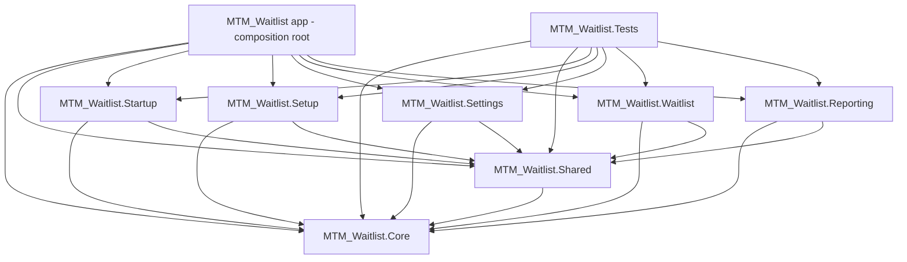

# Test Project Refactor Checklist — Per-Module Class Library Extraction

**Goal:** Fix the "dual build / locked `input.json`" error when running tests from the VS Code test UI by stopping `MTM_Waitlist.Tests` from referencing the WinExe WinUI app and instead splitting testable module code into **one class library per module** that the app and the test project both reference.

**Source of truth:** [MS Learn — Test WinUI apps built with the Windows App SDK](https://learn.microsoft.com/windows/apps/winui/winui3/testing/) — sections *"Testing non-WinUI functionality"* and *"Add a Class Library project for testing"*.

**Diagnosis (complete, do not re-derive):** The test project is a plain MSTest project (`UseWinUI=false`) that `ProjectReference`s the WinExe WinUI app (`..\MTM_Waitlist.csproj`). Running `dotnet test` triggers a second, independent XAML compile of the app project that races with the solution build / running `MTM_Waitlist.exe`, locking `obj\...\input.json`. Fix per MS guidance: extract testable non-view code into class libraries both app and tests reference, so tests never compile the app's XAML.

---

## Target Architecture (per user direction)

Each module is **self-contained**; `Module_Core` and `Module_Shared` are the **shared foundation** that all modules use; the other modules house only their own code. The extraction produces **one class library project per module**, with the app as the composition root.

- **Shared foundation** (used by all modules; must have **no** references to any feature module):
  - `MTM_Waitlist.Core` ← `Module_Core` (core infrastructure, shared contracts/interfaces)
  - `MTM_Waitlist.Shared` ← `Module_Shared` (shared services/models used across modules)
- **Feature modules** (self-contained; reference only `Core` + `Shared`):
  - `MTM_Waitlist.Startup` ← `Module_Startup`
  - `MTM_Waitlist.Setup` ← `Module_Setup`
  - `MTM_Waitlist.Settings` ← `Module_Settings`
  - `MTM_Waitlist.Waitlist` ← `Module_Waitlist`
  - `MTM_Waitlist.Reporting` ← `Module_Reporting`
- **`MTM_Waitlist` (app)** = composition root. Keeps all `Views`, `Controls`, XAML, `App.xaml`, DI wiring, page/navigation registration, and resources. References **all** module projects.
- **`MTM_Waitlist.Tests`** references `Core`, `Shared`, and the feature module(s) under test — **not** the app.

> **Note on namespaces:** keep `MTM_Waitlist.Module_*` namespaces **identical** across the split so XAML `{x:Bind}` bindings and test `using` lines remain unchanged.

## Verified reverse dependencies that MUST be untangled before splitting

The current code puts `Module_Core`/`Module_Shared` *above* feature modules in places, which would create **circular project references** (not allowed in MSBuild) if split naively. Confirmed 2026-08-29 via grep:

- `Module_Core/Contracts/Services/IComputerGateService.cs`, `IComputerRegistryService.cs`, `IStartupCoordinator.cs`, `IStartupRegistrationService.cs`, `IStartupSessionRepository.cs` → `using MTM_Waitlist.Module_Startup.Models`
- `Module_Core/Services/DependencyInjection/ModuleDependencyInjectionExtensions.cs` → `using MTM_Waitlist.Module_Reporting.Services.DependencyInjection`
- `Module_Core/Services/DependencyInjection/ServiceRegistrationExtensions.cs` (DI composition root) → references `Module_Settings`, `Module_Setup`, etc.
- `Module_Core/Services/PageService.cs` → references `Module_Settings`, `Module_Setup`, `Module_Waitlist` Views/ViewModels (page-type registration)
- `Module_Shared/Services/TooltipService.cs` → `using MTM_Waitlist.Module_Startup.Models`

All of these were resolved in **Phase 2** (2026-08-29). `Module_Core` + `Module_Shared` non-view code now has zero references to feature modules (only `Module_Core/Views/ShellPage.xaml.cs` — a View that stays in the app — still references `Module_Waitlist`).

---

## Phase 0: Unblock the test UI now (optional, low-risk)

### Subphase 0.1: Pre-test process hygiene

- [x] **Testing: Confirm the `input.json` lock is caused by concurrent app builds / a running `MTM_Waitlist.exe` holding `obj`/`bin`.** (Ref: Diagnosis) | **Persona: QA Engineer** — verified 2026-08-29: repo `.github/copilot-instructions.md` Build Quirks note PRI175/PRI224 from running exe locking output.
- [ ] **CI/CD: Add a "kill stale build processes" pre-test step so `MTM_Waitlist.exe`, `Microsoft.UI.Xaml.Markup.Compiler`, `VBCSCompiler`, and `MSBuild` are stopped before `dotnet test` runs.** (Ref: Diagnosis) | **Persona: DevOps Engineer**
- [ ] **Testing: Verify a clean test run from the VS Code test UI (with the pre-test step active) no longer reports the locked `input.json` error.** *Depends on: Add a "kill stale build processes" pre-test step* | **Persona: QA Engineer**

**GATE: Either Phase 0 is verified (test UI unblocked) OR Phase 1+ proceed regardless. Phase 0 is a temporary mitigation, not the root-cause fix.**

---

## Phase 1: Scaffold the per-module library projects

### Subphase 1.1: Create and wire the library projects

- [x] **Configuration: Create one WinUI class library per module — `MTM_Waitlist.Core`, `MTM_Waitlist.Shared`, `MTM_Waitlist.Setup`, `MTM_Waitlist.Settings`, `MTM_Waitlist.Waitlist`, `MTM_Waitlist.Startup`, `MTM_Waitlist.Reporting` — each `TargetFramework=net10.0-windows10.0.19041.0`, `TargetPlatformMinVersion=10.0.17763.0`, `UseWinUI=true`, `Nullable=enable`, `ImplicitUsings=enable`, with package versions matching the app (CommunityToolkit.Mvvm, Microsoft.WindowsAppSDK, etc. only as each module needs).** (Ref: Add a Class Library project for testing) | **Persona: Tech Lead** — verified 2026-08-29: seven `MTM_Waitlist.*/*.csproj` created
- [x] **Configuration: Add all seven library projects to `MTM_Waitlist.sln` with `x64` platform mappings mirroring the app.** (Ref: Add a Class Library project for testing) *Depends on: Create one WinUI class library per module* | **Persona: DevOps Engineer** — verified 2026-08-29: `MTM_Waitlist.sln` lists all 7 with x64 mappings
- [x] **Service Layer: Add the project-reference dependency graph: `Shared → Core`; each feature module → `Core` + `Shared`. Add NO feature→feature and NO `Core`/`Shared`→feature references.** (Ref: Target Architecture) *Depends on: Add all seven library projects to the solution* | **Persona: Backend Engineer** — verified 2026-08-29: csproj `ProjectReference`s
- [x] **Service Layer: Add `InternalsVisibleTo("MTM_Waitlist")` and `InternalsVisibleTo("MTM_Waitlist.Tests")` to every library project** (the app currently exposes internals to the test assembly). (Ref: Testing non-WinUI functionality) *Depends on: Add the project-reference dependency graph* | **Persona: Backend Engineer** — verified 2026-08-29: in each csproj

**GATE: `dotnet build` of the solution succeeds with all seven empty projects and the correct reference graph (no circular references).**

---

## Phase 2: Untangle reverse dependencies (prerequisite — do BEFORE moving code)

### Subphase 2.1: Move shared model contracts out of feature modules

- [x] **Data Model: Relocate the `Module_Startup.Models` types referenced by Core contracts and Shared `TooltipService` (`ComputerRecord`, `StartupState`, `StartupSessionSnapshot`, etc.) into `MTM_Waitlist.Core` (or a neutral shared location) and update the `using` statements in `IComputerGateService`, `IComputerRegistryService`, `IStartupCoordinator`, `IStartupRegistrationService`, `IStartupSessionRepository`, and `TooltipService`.** (Ref: Verified reverse dependencies) | **Persona: Backend Engineer** — verified 2026-08-29: all 11 Startup models → `Module_Core/Models` (`MTM_Waitlist.Module_Core.Models`); consumers updated
- [x] **Service Layer: Remove the `Module_Core/Services/DependencyInjection/ModuleDependencyInjectionExtensions.cs` reference to `MTM_Waitlist.Module_Reporting.Services.DependencyInjection` (reporting registration moves to the app composition root).** (Ref: Verified reverse dependencies) | **Persona: Backend Engineer** — verified 2026-08-29: aggregator moved to `Services/DependencyInjection/`

### Subphase 2.2: Relocate the composition root out of Core

- [x] **Service Layer: Move `Module_Core/Services/DependencyInjection/ServiceRegistrationExtensions.cs` (the DI composition root that registers Settings/Setup/Waitlist/etc.) into the app project so `Core` no longer references feature modules.** (Ref: Verified reverse dependencies) | **Persona: Backend Engineer** — verified 2026-08-29: `Services/DependencyInjection/ServiceRegistrationExtensions.cs` (`MTM_Waitlist.Services.DependencyInjection`)
- [x] **Service Layer: Move the page/ViewModel type registration out of `Module_Core/Services/PageService.cs` (which references Settings/Setup/Waitlist Views+ViewModels) into the app's navigation registration; keep `Core`'s `PageService` generic/contract-only.** (Ref: Verified reverse dependencies) | **Persona: Backend Engineer** — verified 2026-08-29: `Services/PageService.cs` (also moved `SampleDataService`, `NavigationViewService`, `ShellViewModel` to app)

**GATE: solution builds and `Core` + `Shared` have zero references to any feature module (verified with a project-reference audit).** *Depends on: Phase 1 GATE*

---

## Phase 3: Migrate the shared foundation (Core + Shared)

### Subphase 3.1: MTM_Waitlist.Core ← Module_Core

- [x] **Service Layer: Move `Module_Core` non-view code — `Contracts`, `Models`, `Services` (non-composition-root), `Helpers`, `Behaviors`, `Selectors`, `Activation`, `Contracts/ViewModels/INavigationAware.cs` — into `MTM_Waitlist.Core` preserving `MTM_Waitlist.Module_Core.*` namespaces.** (Ref: Add a Class Library project for testing) *Depends on: Phase 2 GATE* | **Persona: Backend Engineer** — verified 2026-08-29: moved to `MTM_Waitlist.Core/`; app-coupled services refactored to injected `IAppWindowProvider`/`IShellContentProvider`/`AppServiceLocator`
- [x] **Configuration: Remove moved `Module_Core` files from the app; keep `Module_Core/Views/ShellPage.*` in the app; add `ProjectReference` app → Core; confirm `App.xaml.cs` DI calls resolve against the library.** *Depends on: Move Module_Core non-view code* | **Persona: Frontend Engineer** — verified 2026-08-29: `Module_Core` left with only `Views/`; app→Core reference added

**GATE: solution builds and `MTM_Waitlist.Tests/Module_Core/ModuleCoreServiceTests.cs` passes.**

### Subphase 3.2: MTM_Waitlist.Shared ← Module_Shared

- [x] **Service Layer: Move `Module_Shared` non-view code (Services, Models, ViewModels, DI) into `MTM_Waitlist.Shared` preserving `MTM_Waitlist.Module_Shared.*` namespaces.** (Ref: Add a Class Library project for testing) *Depends on: Module_Core GATE* | **Persona: Backend Engineer** — verified 2026-08-29: moved to `MTM_Waitlist.Shared/`; `TooltipBehavior` uses new `SharedServiceLocator`
- [x] **Configuration: Remove moved `Module_Shared` files from the app; keep `Module_Shared/Views/ControlInspectorDetailPage.*` in the app; add `ProjectReference` app → Shared.** *Depends on: Move Module_Shared non-view code* | **Persona: Frontend Engineer** — verified 2026-08-29: `Module_Shared` left with only `Views/`; app→Shared reference added

**GATE: solution builds and `TooltipServiceTests` + `ControlInspectorServiceTests` pass.**

---

## Phase 4: Migrate feature modules (one at a time; self-contained)

### Subphase 4.1: MTM_Waitlist.Startup ← Module_Startup

- [x] **Service Layer: Move `Module_Startup` non-view code (Services, Models, ViewModels, DI) into `MTM_Waitlist.Startup` preserving namespaces.** (Ref: Add a Class Library project for testing) *Depends on: Phase 3 GATE* | **Persona: Backend Engineer**
- [x] **Configuration: Remove moved `Module_Startup` files from the app; keep `Module_Startup/Views/*` in the app; add `ProjectReference` app → Startup.** *Depends on: Move Module_Startup non-view code* | **Persona: Frontend Engineer**

**GATE: solution builds and `Module_Startup` test suite passes.** (✓ Verified: 54 Startup-related tests green, 2026-08-28)

### Subphase 4.2: MTM_Waitlist.Setup ← Module_Setup (highest test coverage)

- [x] **Service Layer: Move `Module_Setup` non-view code (Contracts, Models, Services, ViewModels, Converters, DI) into `MTM_Waitlist.Setup` preserving namespaces.** (Ref: Add a Class Library project for testing) *Depends on: Phase 3 GATE* | **Persona: Backend Engineer**
- [x] **Configuration: Remove moved `Module_Setup` files from the app; keep `Module_Setup/Views/*` in the app; add `ProjectReference` app → Setup.** *Depends on: Move Module_Setup non-view code* | **Persona: Frontend Engineer**

**GATE: solution builds AND `dotnet test --filter FullyQualifiedName~Module_Setup` passes (32+ tests green).** (✓ Verified: 30 Setup tests green + 4 DB-integration skipped; full suite 246 green, 2026-08-29)

### Subphase 4.3: MTM_Waitlist.Settings ← Module_Settings

- [x] **Service Layer: Move `Module_Settings` non-view code (Services, Models, Converters, ViewModels, DI) into `MTM_Waitlist.Settings` preserving namespaces.** (Ref: Add a Class Library project for testing) *Depends on: Phase 3 GATE* | **Persona: Backend Engineer**
- [x] **Configuration: Remove moved `Module_Settings` files from the app; keep `Module_Settings/Views/*.xaml*` in the app; add `ProjectReference` app → Settings.** *Depends on: Move Module_Settings non-view code* | **Persona: Frontend Engineer**
- [x] **Service Layer (cycle fix, 2026-08-30): Resolve the reported `ImageLocationService ↔ SubscriptionDisposer` dependency "cycle". This is a false positive from the graph tool — `SubscriptionDisposer` was a private nested class inside `ImageLocationService.cs` acting as a subscription token holding a back-reference to its owner. Replaced the named nested type with a closure-based `SubscriptionToken : IDisposable` (depends only on an `Action`) so no separate class node exists and the graph reports no cycle. Verified with a clean `dotnet build`.** | **Persona: Backend Engineer**

**GATE: solution builds and `Module_Settings` test suite passes.** (✓ Verified: 84 Settings tests green + 8 DB-integration skipped; full suite 246 green, 2026-08-29)

### Subphase 4.4: MTM_Waitlist.Waitlist ← Module_Waitlist

- [x] **Service Layer: Move `Module_Waitlist` non-view code (Services, Models, ViewModels, Selectors, Converters, Controls/*RequestTypeViewModel/Model) into `MTM_Waitlist.Waitlist` preserving namespaces.** (Ref: Add a Class Library project for testing) *Depends on: Phase 3 GATE* | **Persona: Backend Engineer**
- [x] **Configuration: Remove moved `Module_Waitlist` files from the app; keep `Module_Waitlist/Views/*` and `Controls/*View.xaml*` in the app; add `ProjectReference` app → Waitlist.** *Depends on: Move Module_Waitlist non-view code* | **Persona: Frontend Engineer**

**GATE: solution builds and `Module_Waitlist` test suite passes.** (✓ Verified: 52 Waitlist tests green; full suite 246 green, 2026-08-29)

#### Subphase 4.4a: Split `MTM_Waitlist.Waitlist` into three feature libraries (decision 2026-08-30)

**Why:** `MTM_Waitlist.Waitlist` (45 `.cs` files) is still the largest single module. Decision: 3-way feature split into **dot-suffixed** projects — `MTM_Waitlist.Waitlist.NewRequest`, `MTM_Waitlist.Waitlist.View`, `MTM_Waitlist.Waitlist.Controls` — with **namespaces kept identical** (`MTM_Waitlist.Module_Waitlist.*`, per the rule used for every other module), Views/Controls `.xaml` staying in the app, and non-view code moving to libraries.

**Verified dependency direction (2026-08-30):**
- `NewRequest → View` — `NewRequestSummaryViewModel` + `NewRequestResultViewModel` use `IWaitlistRequestService` (which lives in the View library).
- **No** `View → NewRequest` and **no** `NewRequest/View → Controls` compile-time dependency (control names are only string literals in `NewRequestFlowRules.GetDefaultTypes()`).
- Reference graph: `View → Core, Shared, Settings`; `NewRequest → Core, Shared, Settings, View`; `Controls → Core, Shared` (self-contained).

- [x] **Configuration: Create three WinUI class libraries — `MTM_Waitlist.Waitlist.NewRequest`, `MTM_Waitlist.Waitlist.View`, `MTM_Waitlist.Waitlist.Controls` — each `TargetFramework=net10.0-windows10.0.19041.0`, `TargetPlatformMinVersion=10.0.17763.0`, `UseWinUI=true`, `Nullable=enable`, `ImplicitUsings=enable`, `RootNamespace=MTM_Waitlist.Module_Waitlist`, `Platforms=x64`, with package versions matching the current `MTM_Waitlist.Waitlist.csproj` (CommunityToolkit.Mvvm, Microsoft.WindowsAppSDK, DI/Configuration abstractions).** | **Persona: Tech Lead**
- [x] **Configuration: Add the three new projects to `MTM_Waitlist.sln` with `x64` platform mappings mirroring the app; after files are distributed, remove `MTM_Waitlist.Waitlist` from the solution.** | **Persona: DevOps Engineer** *Depends on: create projects*
- [x] **Service Layer: Add the reference graph — `Waitlist.View → Core, Shared, Settings`; `Waitlist.NewRequest → Core, Shared, Settings, Waitlist.View`; `Waitlist.Controls → Core, Shared`. Add `InternalsVisibleTo("MTM_Waitlist")` and `InternalsVisibleTo("MTM_Waitlist.Tests")` to each.** | **Persona: Backend Engineer** *Depends on: create projects*
- [x] **Service Layer: Move the Waitlist-viewing code into `MTM_Waitlist.Waitlist.View` preserving namespaces: `WaitlistViewViewModel`, `WaitlistViewDetailViewModel`, `WaitlistRequestService` + `IWaitlistRequestService`, `WaitlistModuleService`, `WaitlistRequest`/`WaitlistRequestDraft`/`WaitlistRequestSubmitResult`/`WaitlistRequestAuditEntry`, `WaitlistDetailTemplateSection`, `SampleOrder`, `WaitlistLineTemplateSelector`.** | **Persona: Backend Engineer**
- [x] **Service Layer: Move the New Request wizard code into `MTM_Waitlist.Waitlist.NewRequest` preserving namespaces: `NewRequest*ViewModel` (7), `NewRequest*` models (`NewRequestTypeDefinition`, `NewRequestSubtypeDefinition`, `NewRequestOptionItem`, `NewRequestFlowState`, `EmployeeVerificationResult`), `NewRequestFlowService` + `INewRequestFlowService`, `NewRequestFlowRules`.** | **Persona: Backend Engineer**
- [x] **Service Layer: Move the Request-type control ViewModels/Models into `MTM_Waitlist.Waitlist.Controls` preserving namespaces: `Coil`, `DieHandling`, `Flatstock`, `ForkliftAssist`, `Other`, `Pickup`, `Scrap`, `TableHandling` (each `*RequestTypeViewModel` + `*RequestTypeModel`).** | **Persona: Backend Engineer**
- [x] **Service Layer: Split the DI extension across the libraries — `AddWaitlistViewServices`, `AddWaitlistNewRequestServices`, `AddWaitlistControlsServices` (one per library) — and have the app composition root (`App.xaml.cs` / `ServiceRegistrationExtensions`) call all three.** | **Persona: Tech Lead**
- [x] **Configuration: Remove moved files from `MTM_Waitlist.Waitlist`; delete that project; add app `ProjectReference`s → `Waitlist.NewRequest`, `Waitlist.View`, `Waitlist.Controls`. Keep all `Module_Waitlist/Views/*` and `Controls/*View.xaml*` in the app.** | **Persona: Frontend Engineer**
- [x] **Configuration: In `MTM_Waitlist.Tests`, replace the `MTM_Waitlist.Waitlist` reference with references to `MTM_Waitlist.Waitlist.NewRequest` + `.View` (+ `.Controls` if directly tested).** | **Persona: Backend Engineer** *(Test project still references the app, which transitively references all three split libraries; full test repointing is Phase 5.2)*

**GATE: solution builds AND the full `Module_Waitlist` test suite passes against the three split libraries.** (✓ Verified: clean `dotnet build` succeeded; full suite 246 green + 12 DB-integration skipped, 2026-08-30)

### Subphase 4.5: MTM_Waitlist.Reporting ← Module_Reporting

- [x] **Service Layer: Move `Module_Reporting/Services` (incl. DI) into `MTM_Waitlist.Reporting` preserving namespaces.** (Ref: Add a Class Library project for testing) *Depends on: Phase 3 GATE* | **Persona: Backend Engineer**
- [x] **Configuration: Remove moved `Module_Reporting` files from the app; add `ProjectReference` app → Reporting.** *Depends on: Move Module_Reporting/Services* | **Persona: Frontend Engineer**

**GATE: solution builds and full test suite passes.** (✓ Verified: full suite 246 green, 2026-08-29)

**GATE: solution builds.**

---

## Phase 5: App composition root + retarget tests

### Subphase 5.1: Complete the app composition root

- [ ] **Configuration: Ensure all module DI extensions (`Add*ModuleServices`) are called from `App.xaml.cs`; confirm `PageService`/navigation registers every page against the now-separate module assemblies.** (Ref: Target Architecture) *Depends on: Phase 4 GATE* | **Persona: Tech Lead**

### Subphase 5.2: Repoint the test project

- [ ] **Configuration: In `MTM_Waitlist.Tests/MTM_Waitlist.Tests.csproj`, remove the `ProjectReference` to `..\MTM_Waitlist.csproj`; add `ProjectReference`s to `MTM_Waitlist.Core`, `MTM_Waitlist.Shared`, and the feature module(s) under test.** (Ref: Testing non-WinUI functionality) *Depends on: Phase 4 GATE* | **Persona: Backend Engineer**
- [ ] **Configuration: Remove the obsolete `AdditionalProperties="WindowsAppSdkBootstrapInitialize=false;..."` from the retargeted references; add `Microsoft.WindowsAppSDK` PackageReference if tests need WinUI types not provided transitively.** (Ref: Testing non-WinUI functionality) *Depends on: Remove the ProjectReference to the app* | **Persona: Backend Engineer**

**GATE: `dotnet build` of the solution succeeds AND the test project no longer pulls the app project into its build graph (verify with `dotnet build -v:diag` or project.assets.json).**

---

## Phase 6: Final validation & cleanup

### Subphase 6.1: Full build + test validation

- [ ] **CI/CD: Run the full solution build cleanly (`dotnet build MTM_Waitlist.sln -p:Configuration=Debug -p:Platform=x64 /m:1 /nodeReuse:false`).** (Ref: Diagnosis) *Depends on: Phase 5 GATE* | **Persona: DevOps Engineer**
- [ ] **Testing: Run the full test suite (`dotnet test`) and confirm all tests pass.** (Ref: Diagnosis) *Depends on: Full solution build* | **Persona: QA Engineer**
- [ ] **Testing: Launch the app in Debug and confirm navigation, DI, and XAML `{x:Bind}` bindings still resolve against the separated module assemblies (spot-check Setup + Waitlist + Settings pages).** (Ref: Add a Class Library project for testing) *Depends on: Full solution build* | **Persona: Frontend Engineer**
- [ ] **Testing: Run tests from the VS Code test UI and confirm no locked `input.json` / dual-build error occurs.** *Depends on: Full test suite* | **Persona: QA Engineer**

### Subphase 6.2: Cleanup and docs

- [ ] **CI/CD: Remove the Phase 0 pre-test kill step if no longer needed, or keep it as defense-in-depth.** (Ref: Diagnosis) | **Persona: DevOps Engineer**
- [ ] **Configuration: Remove any now-unused `Compile Remove`/`None Include` workarounds in `MTM_Waitlist.csproj` that excluded the test folder.** (Ref: Diagnosis) | **Persona: Tech Lead**
- [ ] **Configuration: Update `README.md` / architecture notes to document the per-module project layout (`MTM_Waitlist.Core` + `MTM_Waitlist.Shared` shared foundation, feature modules self-contained, app as composition root) and that tests reference the module libraries, not the app.** (Ref: Add a Class Library project for testing) | **Persona: Tech Lead**

**FINAL GATE: clean `dotnet build` + full `dotnet test` + VS Code test UI with no lock.**

---

## Rollback Plan

- Commit (or stash) before **each** phase (especially Phase 2 untangling and each module migration).
- If a phase breaks the build: revert that phase's file moves / reference changes with git; each library is a drop-in reference with unchanged namespaces, so the app remains compilable between steps.
- If namespaces drifted: do NOT change namespaces during moves — keep `MTM_Waitlist.Module_*` identical so XAML `{x:Bind}` and test `using` lines are untouched.

## Risks

- **Circular project references** — the biggest risk. `Core`/`Shared` must have zero references to feature modules (Phase 2 untangles the current reverse deps) or MSBuild fails with a circular-reference error. Mitigate by auditing the reference graph at the Phase 2 GATE.
- **Composition-root relocation** — `ServiceRegistrationExtensions` / `PageService` page registration move to the app; if missed, DI/navigation breaks at runtime even though the build passes. Verify via Phase 5 spot-check.
- **Resources/localization** — `"Key".GetLocalized()` / `ResourceExtensions` and `App.AppTitlebar` must still resolve from the library projects; verify in the Phase 3/4 GATEs.
- **Self-contained packaging** — the libraries are plain; the app keeps `WindowsAppSDKSelfContained=true` and `WindowsPackageType=None`.
- **ViewModels that reference `Microsoft.UI.Xaml` types** — safe in `UseWinUI=true` class libraries; confirmed pattern in MS docs.
- **XAML code-behind** — must remain view-only and stay in the app project.

---

Next task: **Phase 5 — Complete the app composition root (ensure all module DI is wired) and repoint the test project to reference the module libraries (Core/Shared/Settings/Setup/Startup/Waitlist/Reporting) instead of the WinExe app, dropping the app reference and the `AdditionalProperties` bootstrap workaround.** | **Persona: Tech Lead**
