# Unified Item Picker — Item Workflow Mermaid Diagrams

Based on the unified Item-picker design and the configuration table, there are **19 in-scope Items**: 7 Pickup, 8 Deliver, 3 Assist, and 1 Other. The four Items without a current value source—Finished Goods, NCM, WIP, and Outside Service—are intentionally excluded until their own resolution work lands.

The common navigation is **Work Center → Category → Item → Details → Preview → Summary → Result**, with the Item list filtered to what the selected job actually supports.

**Every workflow decides whether an Item is offered before the user can select it.** The availability check sits
*above* the Item step, because it is the step that builds the Item list — a job that cannot support an Item never
shows that Item to click. Every diagram below is drawn in that order:
Work Center → Category → availability check → Item.

## 1. Pickup workflows

### Pickup — Coil or Flatstock

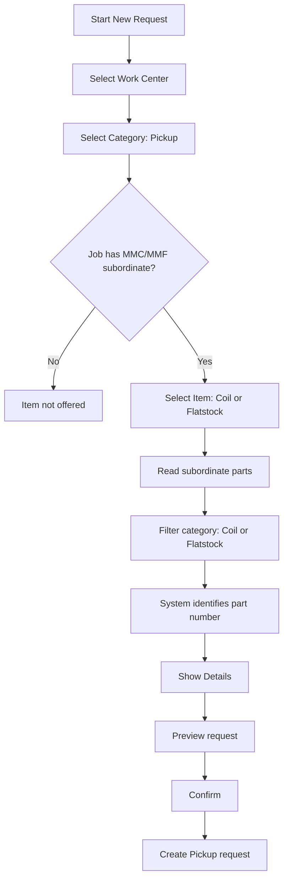

**Rule:** no user selection is required for the material itself; visibility depends on the requesting job having MMC/MMF subordinate material.

---

### Pickup — Die

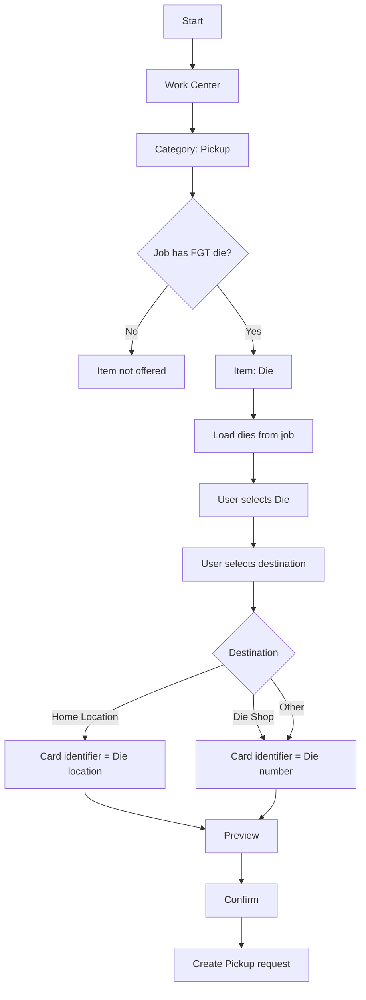

The user selects both the die and destination; the displayed identifier changes when the destination is Home Location.

---

### Pickup — Component

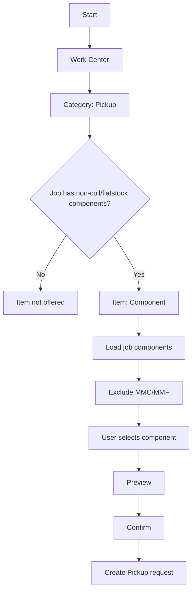

---

### Pickup — Riser Table

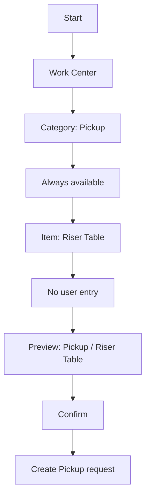

Riser Table is equipment rather than a job part, so it is always available.

---

### Pickup — Dunnage

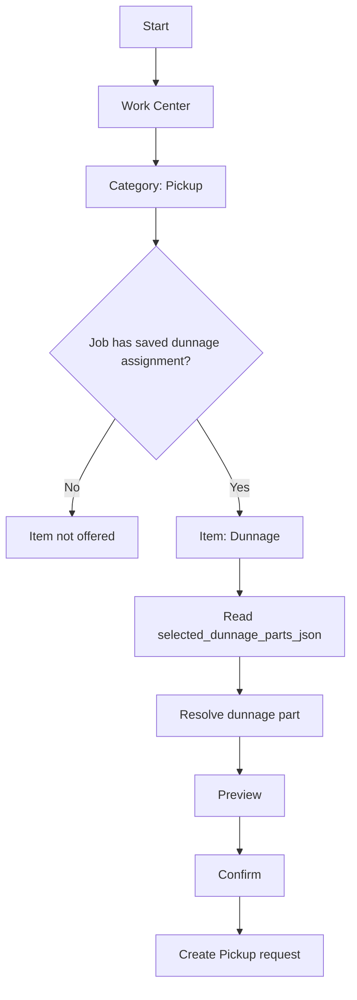

---

### Pickup — Scrap removal

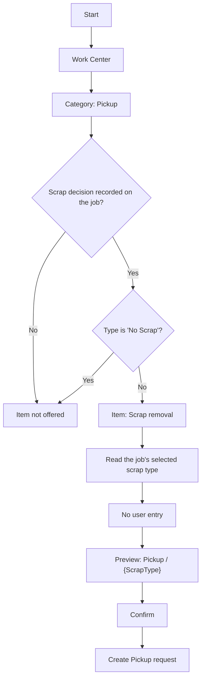

**The scrap type is already set on the job** during Work Center Setup, so the user never types it.

A scrap decision counts as **recorded** only when the stored value is a real type: set, not `No Scrap`, and not the
`Scrap Type Required` placeholder. That placeholder is the workflow's fallback whenever nothing has been saved or a
suggestion finds no match, so a stored placeholder means **no decision was made** — not "no scrap". The codebase's
canonical test is `HasScrapDecision` in `SetupDunnageTypeViewModel`; it excludes the placeholder and treats
`No Scrap` as an explicit, valid decision.

`No Scrap` is therefore a real answer rather than an absence: a job that chose it has no scrap to collect, so the
Item is not offered. Otherwise Line 2 carries the job's scrap type.

The picker's options come from `s_defaultScrapTypes` in `SetupWorkflowService` — `3003 Aluminum`, `5052 aluminum`,
`Galvanized Steel`, `Steel`, `Skeleton`, `Gaylord`, plus `No Scrap`. Spell them exactly: `5052 aluminum` is
lowercase, and `Galvanized` is `Galvanized Steel`.

---

### Pickup — Hopper

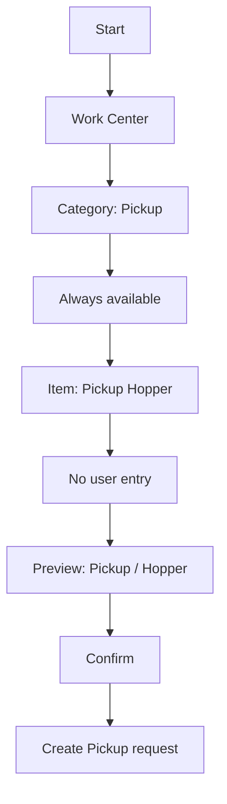

The hopper is treated as a manual consumable/equipment item with no user entry.

---

## 2. Deliver workflows

### Deliver — Coil

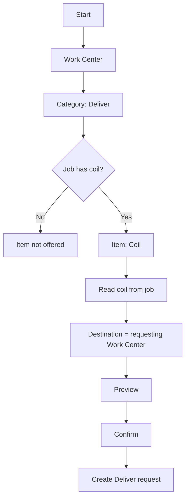

Destination is always the requesting work center and is not user-entered.

---

### Deliver — Riser Table

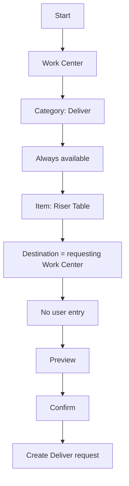

---

### Deliver — Hopper

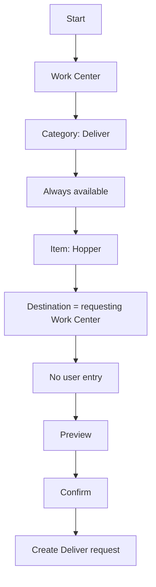

---

### Deliver — Flatstock

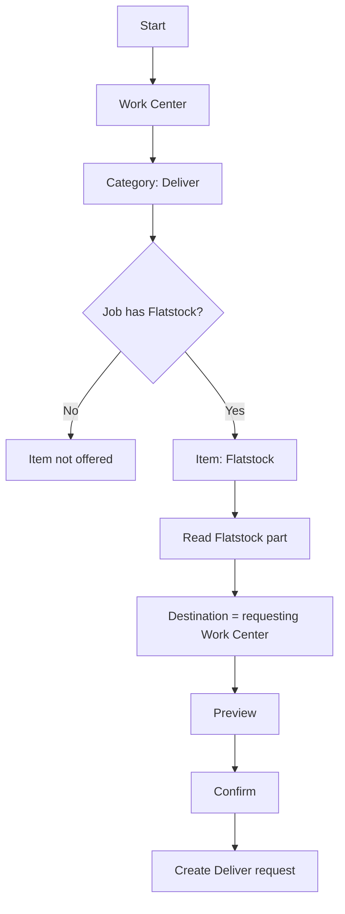

An important rule here is that **if no Flatstock is found, the Item is not shown at all**.

---

### Deliver — Die

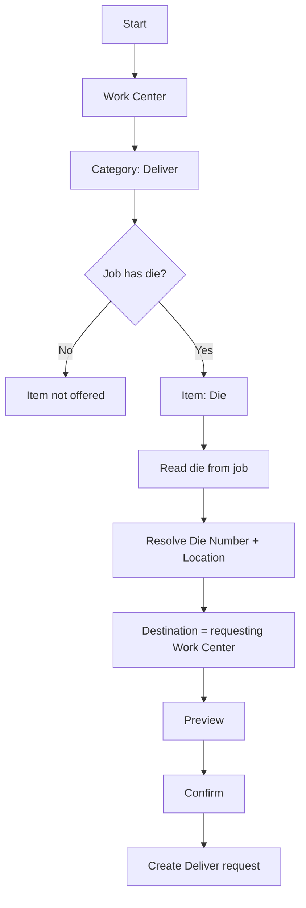

---

### Deliver — Dunnage

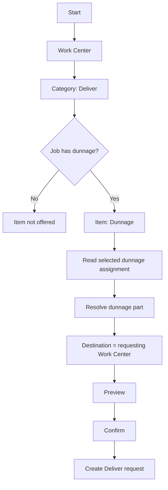

---

### Deliver — Wrong Coil

**One Deliver request, not a compound operation.** The handler swaps the wrong coil for the correct one as part of
the deliver, so the request names itself as a wrong-material bring.

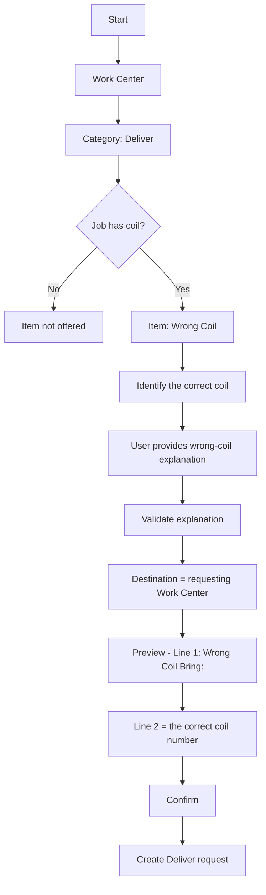

**Line 1 reads `Wrong Coil Bring:`** and **Line 2 carries the correct coil's number** — the coil being brought,
not the wrong one being taken away. The Category stays **Deliver**, and there is no second request.

---

### Deliver — Wrong Flatstock

**One Deliver request, not a compound operation** — the same shape as Wrong Coil.

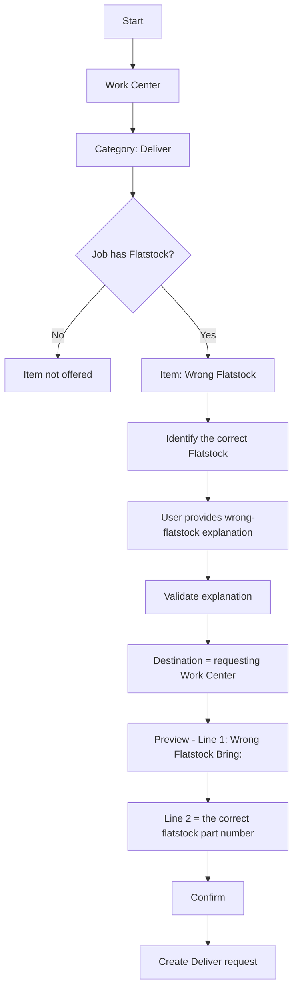

**Line 1 reads `Wrong Flatstock Bring:`** and **Line 2 carries the correct flatstock's part number**. The handler
swaps the wrong flatstock for the correct one as part of the deliver.

---

## 3. Assist workflows

### Assist — Coil / Turn Coil

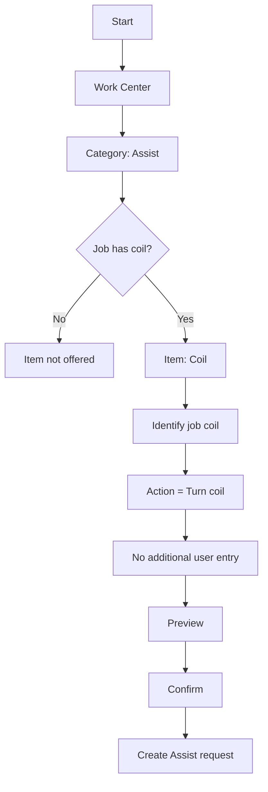

Here the **action itself is the request**; there is no separate value-entry step.

---

### Assist — Place Parts on Table

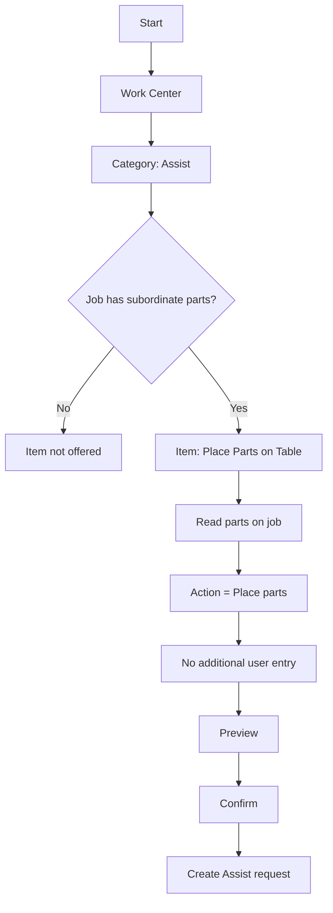

---

### Assist — Remove Parts from Table

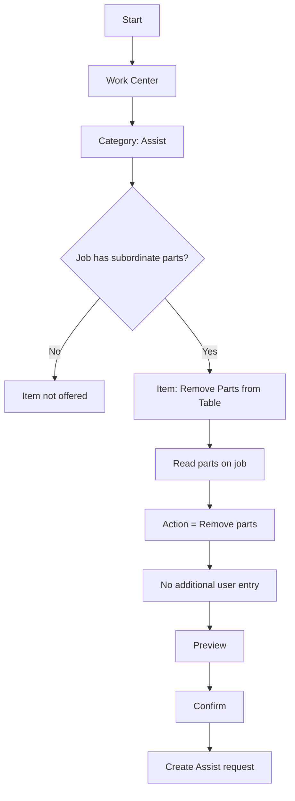

The two table-assist Items are explicitly visibility-filtered by whether the job has subordinate parts.

---

## 4. Other workflow

### Other — Free-text request

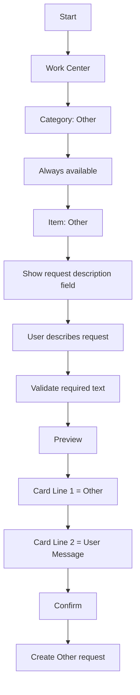

Other is the catch-all free-text Item and replaces the former Pickup Other and Assist Forklift paths.

---

## 5. The common Item-picker shell

All 19 workflows should sit inside the same picker architecture rather than implementing separate navigation flows:

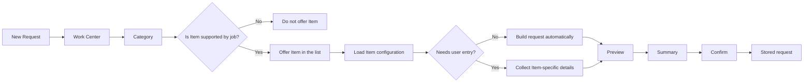

The important architectural point is that **Item configuration determines the detail behavior**. The application should not have a separate hardcoded workflow for each legacy subtype.

---

## 6. Unified request lifecycle after creation

Once any of the 19 Items creates a request, the downstream lifecycle should be identical:

```mermaid
stateDiagram-v2
    [*] --> Waiting

    Waiting --> InProgress: Handler accepts
    Waiting --> Cancelled: Requester cancels

    InProgress --> Done: Assigned handler completes
    InProgress --> Waiting: Assigned handler releases

    Done --> [*]
    Cancelled --> [*]
```

This is important to the unified-card design: **the Item changes what the request means and what data it carries, but it does not create a different lifecycle model.** The existing handler workflow covers accepting, completing, releasing, requester cancellation, authorization, and persistence.

---

## 7. Unified card representation

Every successful path should converge on the same conceptual card:

```mermaid
flowchart TD
    A["Created Request"] --> B["Category / Umbrella Verb"]
    B --> C["Item-specific identifier"]
    C --> D["Common status / urgency / ownership"]
    D --> E["Common action area"]

    B --> F["Line 1"]
    C --> G["Line 2"]

    F --> H["Uniform 2-line card"]
    G --> H
```

The design specifically calls for **one uniform card across the in-scope Items**, with Line 1 representing the umbrella verb and Line 2 carrying the Item identifier; type-specific detail belongs on the detail page rather than creating another card layout.

### Deliberate exclusions

I would **not** create workflows for:

- `Pickup → Finished Goods`
- `Pickup → Non-Conforming (NCM)`
- `Pickup → WIP`
- `Pickup → Outside Service`

Those four are explicitly outside the current implementation because they do not yet have a persisted value source/resolution path. The current specification says they remain hidden until that work lands.

This gives you a clean implementation model:

**19 Item-specific detail flows → one shared preview/summary/create path → one shared request lifecycle → one shared card representation.**
