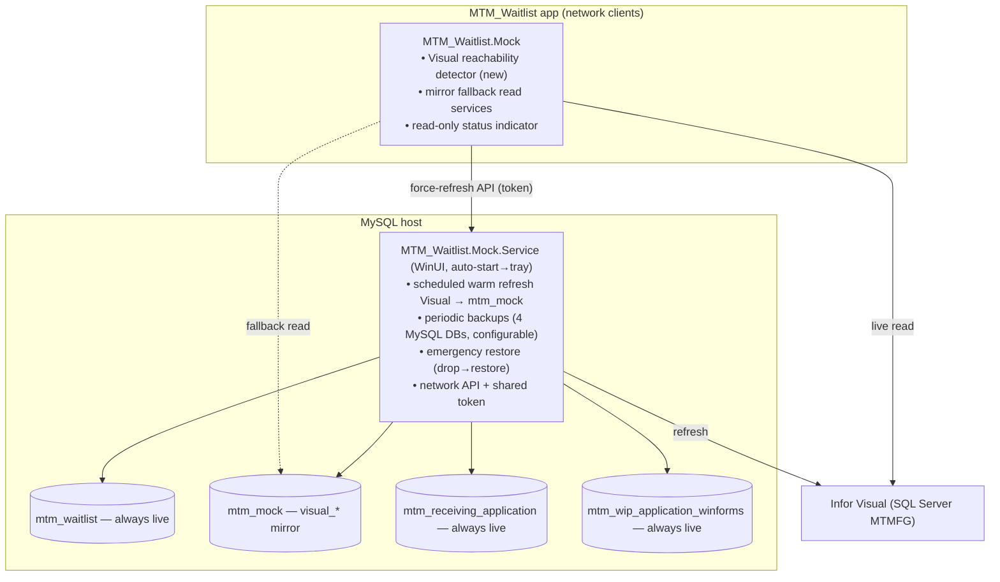

# Module_Mock — Specification

> **Status:** Draft for review (2026-09-09). Planning artifacts: `Spec.md` (this), `Plan.md`, `Tasks.md`.
> **Companions:** `Module_Mock-Planning-Progress.md`, `Discovery/01-MockLogic-Inventory.md`,
> `Discovery/02-InforVisual-ReadShapes.md`, `Discovery/03-Hardcoded-MySQL-Sql.md`.
> **Audience:** implementers of the Module_Mock workstream.

---

## 1. Background & problem

The app currently carries **two unrelated "mock" systems**:

- **Family A — in-app sample / short-circuit.** `Sample*` catalogs + `Feature.InforVisualMockData` /
  `Feature.RecvMockData` toggles + helper-server `mockAction`/`backendAction` branching + an auto-force routing
  stack. It short-circuits reads/writes to **all** data sources — including the app's **own** `mtm_waitlist`
  DB. This causes the reported defect: a mock-mode setup save calls `SetupPersistenceService.SaveMockAsync`
  (a no-op success stub) while the work-center card reads the live `mtm_waitlist` tables → the card never updates.
- **Family B — DB-backed mock master tables.** `mock_parts/_work_orders/_work_centers/_locations/
  _inventory_locations/_requesters/_request_types` + `mock_master_tables_registry` + `sp_mock_*` +
  `MockMasterDataService`, in `mtm_waitlist`, with **no production UI consumer**.

Both are being **retired**. The app's own `mtm_waitlist`, plus the WIP and Receiving MySQL DBs, are always live
(they share one MySQL server that is effectively always up). The only external system that can genuinely be
unreachable is **Infor Visual** (a separate SQL Server), which the app reads but never writes.

## 2. Goals

- **G1** Provide an automatic, read-only fallback for **Infor Visual** reads so the app keeps working when
  Visual is unreachable.
- **G2** Back that fallback with a **real-data cache** (`mtm_mock` MySQL DB) kept warm by a service app.
- **G3** Make `mtm_waitlist`, WIP, and Receiving **always live** — remove all mock short-circuits that skip
  real reads/writes (fixes the setup-save defect and the waitlist request-lifecycle skip).
- **G4** Remove families A and B entirely (code, DB artifacts, toggles, settings UI, tests), keeping a single
  read-only automatic status indicator.
- **G5** Introduce a lightweight **service app** that owns scheduled refreshes, periodic backups of the 4 MySQL
  DBs, emergency restore, and a small network API.
- **G6** Convert hard-coded/inline MySQL SQL to stored procedures (existing where one fits, else new).
- **G7** Document an **extensibility playbook** so new Visual read shapes can be mirrored with minimal effort.

## 3. Non-goals

- **NG1** Mocking `mtm_waitlist`, `mtm_wip_application_winforms`, or `mtm_receiving_application`.
- **NG2** Writing to Infor Visual (read-only to the app forever).
- **NG3** Backing up or restoring Infor Visual (SQL Server) — out of scope for the service app.
- **NG4** A manual mock toggle in the app (fallback is fully automatic).
- **NG5** Role/privilege management in the service app (it runs on a restricted host).

## 4. Scope summary

| System | Mode | Notes |
|---|---|---|
| `mtm_waitlist` (own DB) | **Always live** | setup saves, work centers, requests, defect types, config |
| `mtm_receiving_application` | **Always live** | dunnage, receiving history |
| `mtm_wip_application_winforms` | **Always live** | floor FG/WIP stock |
| Infor Visual (SQL Server `VISUAL`/`MTMFG`) | **Live, with automatic `mtm_mock` fallback** | read-only; 5 read shapes |
| `mtm_mock` (new MySQL DB) | **Cache** | `visual_<readShape>_result` mirror tables |

## 5. Architecture

## 6. Data model — `mtm_mock`

New dedicated MySQL database (same server as the other three). Naming:
- Mirror tables: **`visual_<readShape>_result`** — column set mirrors the exact output of the corresponding
  live read (one table per read shape).
- Procs: **`sp_visual_<readShape>_{get,refresh}`** (plus a staging procedure/table for atomic swap).
- Staging + atomic swap: each refresh builds a `<table>_stage` then `RENAME TABLE` swaps it into place so
  readers always see a complete snapshot with no lock/lag.

### 6.1 The five read shapes (initial)

| Mirror table | Source (Visual) | Inputs | Columns |
|---|---|---|---|
| `visual_work_order_lookup_result` | `LookupWorkOrder.sql` | NormalizedWorkOrder | PartNumber, Description, WorkCenter |
| `visual_operation_sequences_result` | `GetSequences.sql` | NormalizedWorkOrder, PartNumber | SequenceNumber, Description |
| `visual_subordinate_parts_result` | `GetSubordinateParts.sql` | NormalizedWorkOrder, PartNumber, SequenceNumber | Category, PartNumber, Description, Location, User8, OnHandQuantity |
| `visual_inventory_locations_result` | `GetInventoryLocations.sql` | PartNumber | PartNumber, Location, OnHandQuantity |
| `visual_disposition_input_result` | `GetDispositionInput.sql` | WorkOrder, PartNumber | WorkOrderStatus, OpenWorkOrderQuantity, FinishedGoodsQuantity, HasOutsideVendorOperation |

Each table carries the read's input columns (as indexed lookup keys) plus its output columns, plus refresh
metadata (e.g. `refreshed_utc`).

## 7. In-app component — `MTM_Waitlist.Mock` (class library)

- **7.1 Visual reachability detector (new).** Independently probes Infor Visual connectivity and exposes a
  current state + change event. Does **not** reuse the legacy `MockRoutingService` stack (being removed).
- **7.2 Mirror fallback read services.** Drop-in replacements for the 5 read paths
  (`IInforVisualLookupService`/`ISubordinatePartService` (Setup), whole waitlist inventory read, disposition
  input read). Behavior: try live Visual; on unreachable/timeout, read `mtm_mock` via the corresponding
  `sp_visual_*_get`. A read result is identical in shape whichever source served it.
- **7.3 Status indicator (read-only).** A non-interactive UI surface (e.g. an info bar/icon) shown when the
  fallback is active: "Infor Visual unreachable — using cached data." No toggle, no user action.
- **7.4 Force-refresh client.** A thin HTTP client that calls the service app's API to request an immediate
  refresh (used by the indicator/status or a developer affordance), token-gated.

## 8. Service app — `MTM_Waitlist.Mock.Service` (WinUI 3)

Single WinUI app launched on the MySQL host, **auto-start on logon, minimized to tray**; keeps running and:
- **8.1 Refresh engine.** On a configurable interval, for each mirrored read shape, pull from live Visual and
  atomically swap the staging table into `mtm_mock`. Skips silently (logged) when Visual is unreachable.
- **8.2 Backup engine.** Periodic `mysqldump` backups of **all four** MySQL DBs
  (`mtm_waitlist`, `mtm_wip_application_winforms`, `mtm_receiving_application`, `mtm_mock`), **configurable
  per-DB** (enable, schedule, retention, location).
- **8.3 Restore.** Emergency **full drop → restore** of a selected DB from a chosen backup. Guarded by an
  explicit confirmation; no role system (host-restricted).
- **8.4 Settings UI.** Edit refresh interval, per-DB backup schedule/retention/location, API port/token,
  Visual connection details; show last-refresh/backup status.
- **8.5 API.** Small HTTP API (network-bound) with a shared token: `POST /api/refresh` (force a refresh),
  `GET /api/status`, and backup/restore endpoints used by the settings UI. Clients (the app) call `/api/refresh`.

## 9. Removal scope

Retire **family A** (sample catalogs, `ISampleDataService`, helper-server mock branches, `Feature.*MockData`
keys, `MockRoutingService`/`MockMode*`/`MockToggleService`/`MockConfigurationService` + `IPollScheduler` +
toast coordinator, Settings `UseMockData` toggle + `MockDataExpander`), **family B** (`mock_*` tables,
`sp_mock_*`, `MockMasterDataService`, seeds, registry), the `MtmWaitlist`/receiving/infor mock gating, and the
associated tests. Full artifact list: `Discovery/01-MockLogic-Inventory.md`. The **only** retained UI is the
read-only status indicator (§7.3).

## 10. Hard-coded SQL → stored procedures

Every inline/hard-coded MySQL SQL statement is replaced by a stored procedure — the existing SP where one
covers it, otherwise a newly created SP. Full list with file:line and the existing-SP mapping is
`Discovery/03-Hardcoded-MySQL-Sql.md`. Priority examples: `AverageCoilWeightService.cs:14` →
`sp_receiving_history_average_coil_weight`; `WorkCenterCatalogService.cs:272–333` →
`sp_config_hot_workcenters_delete_for_computer`/`_upsert`; Startup auth/registry + Settings image overrides
+ Shared dunnage visibility → new SPs.

## 11. Extensibility — adding a new Visual read shape

The mirror must be trivial to extend. Adding a shape requires, in order:
1. Add the read's `.sql` under `Database/InforVisual/Queues/**` (if not present).
2. Add `mtm_mock.visual_<readShape>_result` (+ `_stage`) create/rollback per DB naming rules; register in the
   mock table master list.
3. Add `sp_visual_<readShape>_refresh` (populate stage from a passed result set / from Visual) and
   `sp_visual_<readShape>_get` (typed/parameterized read); register in the SP master list.
4. Add the shape to the refresh engine's configurable shape catalog (service app).
5. Add a mirror read service in `MTM_Waitlist.Mock` and route the C# caller through the live→fallback pattern.
6. Add tests (refresh + fallback parity + caller) and a seed row set.

This playbook is documented for implementers in `Plan.md` §7 and enforced by a `Tasks.md` documentation task.

## 12. Behavior changes

- Mock-mode setup saves now **always write** `mtm_waitlist` → the work-center card updates (defect fixed).
- Waitlist request reads/writes (list/accept/note/status/cancel/audit) **always persist** to `mtm_waitlist`.
- New Request offerings, coil reads, etc. come from **real** DBs; the only fallback is Visual → `mtm_mock`.
- The Settings "Mock Data" toggle is **removed**; replaced by the read-only status indicator.
- Gaps to fix while here: `CoilAvailabilityService` live source unwired; reconcile DB request-type catalog vs
  legacy `waitlist-request-types.json`.

## 13. Open/assumed

- `mysqldump` (MySQL client tools) available on the MySQL host for backups.
- The service app's WinUI process may host a background engine + Kestrel API in-process; document the WinUI
  app-lifecycle constraints (auto-start entry, tray lifetime).
- Client → service API is network-reachable and gated by a shared token (matches "no heavy privilege control").

## 14. Glossary

- **Read shape** — a distinct Infor Visual query result the app consumes (5 today).
- **Mirror** — `mtm_mock.visual_<readShape>_result`, the cached copy of a read shape.
- **Fallback** — automatic switch to reading the mirror when Visual is unreachable.
- **Family A / B** — the two legacy mock systems (see §1).
