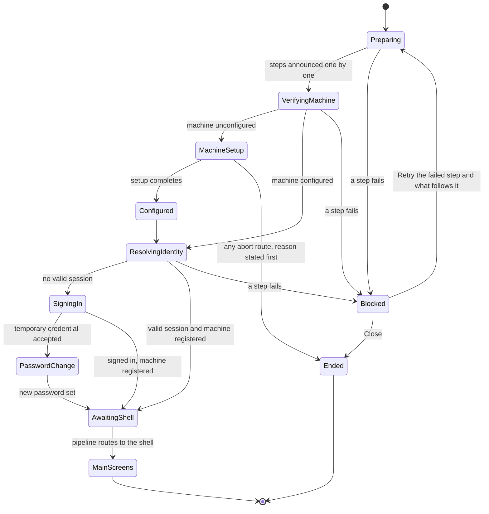

# Phase 1 Data Model: Startup Rebuild

The entities the spec names in its Key Entities section, plus the store artifacts the brief's S11 defines.
Every column name that already exists in `Database/` is quoted as it is today. Every identifier the spec pins
verbatim is reproduced exactly: `user_active_sessions`, `ops_startup_logs`, the table's two roles
`IT Department` and `Developer` (which appear in the store as the role codes `role:it_department` and
`role:developer`), and the UNC key-file path.

Two entities exist only in memory and have no table: the launch step and the activity-feed line. They are
described here because the spec lists the launch step as a key entity and because the contracts in
`contracts/launch-step-contract.md` are built on them.

---

## E1. Person

Who is signed in. Read from the store, never editable from the application during a launch (FR-022).

Store: existing `core_users_profiles`, `auth_roles_catalog`, `auth_roles_assignments`. **Unchanged by this
feature.** Listed because it is the source of the identity contract and because two rows of it are seeded
differently (D16).

| Field (contract name) | Source column | Notes |
|---|---|---|
| `UserId` | `core_users_profiles.id` | |
| `SignInName` | `core_users_profiles.username_normalized` | unique, and upper-normalised by `seed_username_upper_normalization` |
| `DisplayName` | `core_users_profiles.display_name` | `first_name` and `last_name` are also present |
| `EmployeeNumber` | `core_users_profiles.employee_identifier` | nullable |
| `CurrentRoleCode` | `auth_roles_assignments` joined to `auth_roles_catalog` | the role in force for this session |
| `HeldRoleCodes` | all assignments for the user | the set, not just the current role |

Two credential facts already live on this table and are read, not re-invented: `require_password_change`
carries the temporary-credential state that FR-013 depends on, and `temporary_credential_failed_attempts`
carries the five-attempt counter FR-012 depends on. The counter is updated through the shared procedure
`sp_auth_temporary_credential_attempt_record`, which user management also uses, so the limit is a store-side
fact that already survives a restart and is not re-implemented in the application.

**Validation rules drawn from requirements**

- The identity is read-only to every consumer (FR-022). The only writer is the launch pipeline.
- A role is never taken from a local claim. The store is the sole authority, and the `appsettings.json` developer
  allow-list is retired (FR-030 does not apply here: this is a role source, not a setting restriction).
- `HeldRoleCodes` must contain the literal role codes `role:it_department` and `role:developer` for FR-007,
  FR-024 and FR-029 to be satisfiable.

**Seed change**: `seed_dev_masked_baseline` grants `Developer` to `JKoll` and `JohnK`, so each of the two
seeded machines has a developer who can sign in without the retired allow-list.

---

## E2. Machine

The computer the application runs on. Store: existing `core_computers_registry`. **Extended by this feature**
only in what the application writes to it, not in shape.

| Field (contract name) | Source column | Notes |
|---|---|---|
| `Hostname` | `core_computers_registry.hostname_normalized`, and `computer_name` for the display form | also read from the machine itself |
| `MacAddress` | `core_computers_registry.mac_address_normalized` | the stable hardware address |
| `ComputerId` | `core_computers_registry.id` | null until configured |
| `DisplayName` | `core_computers_registry.display_name` | what people recognise |
| `Description` | `core_computers_registry.description` | nullable |
| `IsRegistered` | `core_computers_registry.is_registered`, matched on `hostname_normalized` and `mac_address_normalized` | the column exists today and the match confirms it |
| `HardwareIdentityReadable` | derived: a usable MAC was obtained | |

**Validation rules drawn from requirements**

- **FR-015**: an unreadable hardware identity admits the person. An unreadable fact is not a failed check, so
  the gate reports it could not be performed rather than refusing.
- **FR-006, FR-009**: unconfigured, removed, revoked and unreadable all resolve to the same verdict,
  unconfigured, at the next check.
- Display name must be unique: the edge case "the machine's display name is already in use" requires the save to
  be refused and a different name asked for. The store already enforces this with
  `uq_core_computers_registry_display_name`, so the application surfaces the refusal rather than inventing the
  check.
- A renamed machine that matches on hardware identity is distinct from an unknown machine: the person is asked to
  confirm the display name rather than to register.

---

## E3. Machine configuration

What a machine needs before it may be used: its own identity and where its pictures come from. **Records are not
part of it**, because records live only in the store (decision 23, FR-025).

Store: `core_computers_registry` for the identity, and `config_images_locations` at `computer` scope for the
picture sources. `config_images_locations` already carries `scope`, `scope_item_id` and a `scope_paths_get`
procedure, and `fn_config_settings_scope_rank` ranks `computer` at 1, so the machine scope exists. The
implementation task confirmed in `research.md` is to verify the machine scope can express the source-folder
shape (shared folder, keys folder, dunnage root) and add what is missing as new procedures.

| Field | Where | Notes |
|---|---|---|
| `DisplayName` | `core_computers_registry.display_name` | captured in machine setup |
| `Description` | `core_computers_registry.description` | captured in machine setup |
| `SharedFolderPath` | `config_images_locations` at `computer` scope | was `ImageStorageOptions.SharedFolderPath` |
| `KeysFolderPath` | `config_images_locations` at `computer` scope | was `ImageStorageOptions.KeysFolderPath` |
| `DunnageRootFolder` | `config_images_locations` at `computer` scope | was `DunnageImageOptions.RootFolder` |

**State transitions**

| From | Event | To |
|---|---|---|
| Unconfigured | launch reaches the readiness check | Stops at machine setup before any operator sign-in (FR-006) |
| Configured | configuration removed, revoked or unreadable | Unconfigured at the next check (FR-009) |
| Configured | person completes setup | Configured, launch continues (S10.1) |
| Unconfigured, setup open | any abort route | The process ends, after stating why (FR-008) |

**Validation rules drawn from requirements**

- **FR-007**: setup is authorised only by a person holding `IT Department` or `Developer`, and that
  authorisation does not open the main screens.
- **FR-008**: every route out that is not completion ends the application, and the ending is preceded by a
  statement of why.
- **FR-006, S10.1**: refusing to continue lives in the pipeline, not only in the screen, so a dismissal route the
  UI misses still cannot reach the shell.
- **FR-018**: a reset affects this machine's configuration only. It never changes people, roles or permissions.

---

## E4. Session

A person's signed-in period on one machine. Store: **new table `user_active_sessions`**.

| Field | Type | Notes |
|---|---|---|
| `id` | `BIGINT NOT NULL AUTO_INCREMENT` | primary key |
| `public_id` | `CHAR(36) NOT NULL` | unique, the identifier the app uses |
| `user_id` | `BIGINT NOT NULL` | foreign key to `core_users_profiles (id)` |
| `computer_id` | `BIGINT NOT NULL` | foreign key to `core_computers_registry (id)`; the machine key |
| `token_hash` | `CHAR(64) NOT NULL` | the token as a salted hash. Plaintext is never stored |
| `token_salt` | `VARBINARY(32) NOT NULL` | |
| `issued_utc` | `DATETIME NOT NULL` | |
| `expires_utc` | `DATETIME NOT NULL` | resolved from the session-length setting at issue time (D17) |
| `revoked_utc` | `DATETIME NULL` | set when cleared |
| `is_active` | `TINYINT(1) NOT NULL DEFAULT 1` | |
| `source_label` | `VARCHAR(32) NOT NULL` | where the session came from, so the decision can be traced |
| `created_utc` | `DATETIME NOT NULL` | |

Keys: `PRIMARY KEY (id)`, `UNIQUE KEY` on `public_id`, `UNIQUE KEY` on `(user_id, computer_id)` to enforce one
active row per person per machine, and an index on `(is_active, expires_utc)` for validation.

**Relationships**: one person to many sessions over time, at most one active per person per machine. One machine
to many sessions. The column shape deliberately follows the table it supersedes, `auth_sessions_tokens`, which
carries the same token, salt, issue, expiry, revocation and source fields; that table is deleted in the same
phase (E9).

**State transitions**

| From | Event | To |
|---|---|---|
| None | Sign-in completes, machine gate passed | Active row written with `expires_utc` = store now + session length |
| Active | Session validated | Valid only while `fn_server_utc_now() < expires_utc` (FR-010) |
| Active | Sign-out | Cleared before the application restarts (FR-011) |
| Active | Expiry passed | Not valid. The person is asked to sign in again |
| Cleared | Sign-in again | A new row, with the session length read afresh (SC-011) |

**Validation rules drawn from requirements**

- **FR-010**: validity is judged on `fn_server_utc_now()`, never the workstation clock.
- **FR-011**: sign-out clears the session before the restart. A restart that fails still leaves the session
  ended, and the person is told to open the application again.
- **SC-011**: a change to the session length takes effect at the next sign-in, not on an in-flight session.
- A password reset must not end an existing session (S14), so no procedure clears sessions by user for that
  reason.
- The row is written only after the machine gate passes (S8.1).
- **FR-025**: no part of the session is written to the machine.

---

## E5. Remembered sign-in

A person's choice to be recognised on one machine. Store: **new table `auth_remembered_sign_ins`** (D12).

| Field | Type | Notes |
|---|---|---|
| `id` | `BIGINT NOT NULL AUTO_INCREMENT` | primary key |
| `public_id` | `CHAR(36) NOT NULL` | unique |
| `user_id` | `BIGINT NOT NULL` | foreign key to `core_users_profiles (id)` |
| `computer_id` | `BIGINT NOT NULL` | foreign key to `core_computers_registry (id)` |
| `payload_ciphertext` | `VARBINARY(512) NOT NULL` | AES-encrypted. Decryptable, not hashed |
| `payload_iv` | `VARBINARY(16) NOT NULL` | initialisation vector, stored beside the payload |
| `key_fingerprint` | `CHAR(64) NOT NULL` | lets a rotated key be detected and fall back rather than fail |
| `is_active` | `TINYINT(1) NOT NULL DEFAULT 1` | |
| `created_utc` | `DATETIME NOT NULL` | |
| `updated_utc` | `DATETIME NOT NULL` | |

Keys: `PRIMARY KEY (id)`, `UNIQUE KEY` on `public_id`, `UNIQUE KEY` on `(user_id, computer_id)`.

**Validation rules drawn from requirements**

- **FR-014**: held against the person in the store, and encrypted.
- **FR-014**: a failure to read what protects it falls back to the ordinary sign-in form, and nothing is kept on
  the machine in its place.
- The key comes from the shared file at
  `\\mtmanu-fs01\Expo Drive\Software Development\Live Applications\MTM_Application_Keys\MTM_AUTH_USER_SECRET_KEY.txt`.
  The file is read only, never written or rotated (D13).
- The key, the payload and the plaintext are never logged.
- A failed decrypt records the fault and never blocks the launch.

---

## E6. Scoped preference

A choice that belongs to a person, a machine, a role or the whole plant. Store: existing
`config_settings_values` with `fn_config_settings_scope_rank`, plus `config_settings_history`.

**Scope precedence** (from the rank function, higher wins): `computer` 1, `all_users` 2, `role` 3, `admin` 4,
`developer` 5, `user` 6.

| Key | Scope | Owner | Source today |
|---|---|---|---|
| `AppBackgroundRequestedTheme` | person | the person | `ThemeSelectorService` |
| `Waitlist.SortOrder` | person | the person | `WaitlistSortPreferenceService` |
| `User.NewRequestAlertsEnabled` | person | the person | `NewRequestAlertService` |
| `Waitlist.MessageSeen` | person | the person | `LocalWaitlistMessageSeenStore` |
| `Setup.DunnageImageSearch.ShowPartsWithoutImages` | person | the person | `SetupDunnageImageSearchDialogViewModel` |
| `Feature.IgnoredLocations` | plant (`all_users`) | the plant | `IgnoredLocationsService`, plus a duplicate write path in `SettingsViewModel` that is deleted |
| session length | plant (`all_users`) | the plant | new (FR-029) |

**Validation rules drawn from requirements**

- **FR-023**: a person's preferences are held against the person in the store.
- **FR-024**: the locations-to-hide list belongs to the whole plant and is changeable only by `IT Department` or
  `Developer`. Reading stays available to everyone; changing is gated by
  `permission.settings.ignored_locations_edit` (D10).
- **FR-029**: the session length is changeable only by `IT Department` or `Developer`.
- **FR-030**: every setting that is restricted to particular roles today keeps the same restriction. The four
  new keys and the one new edit key are additions; no existing key's grants change.
- **FR-025**: only what is needed to reach the store stays on the machine, apart from the local picture copy.
- The `PictureEnlargePreference` key is the existing pattern to copy, since it already uses this store.
- `LocalSettings.json` and the whole `ILocalSettingsService` mechanism are deleted, so no key above remains a
  file.

---

## E7. Permission key

Not a new entity, but four keys are added to the existing permission catalogue and baselined per role.

| Key | Roles that hold it | Requirement |
|---|---|---|
| `permission.settings.machine_configuration` | `IT Department`, `Developer` | FR-007 |
| `permission.settings.ignored_locations_edit` | `IT Department`, `Developer` | FR-024 |
| `permission.settings.log_panel` | `Developer` | US5, SC-005 |
| `permission.settings.session_length` | `IT Department`, `Developer` | FR-029 |

Existing key left untouched: `permission.settings.ignored_locations`, whose current grants are 1 for
`role:developer`, `role:it_department`, `role:plant_manager`, `role:production_lead`, `role:setup_lead`,
`role:production` and `role:setup`, and 0 for `role:material_handler` and `role:material_handler_lead`. Leaving
it untouched is what keeps FR-030 true (D10).

**Validation rules drawn from requirements**

- Each key is enforced where the action happens, not only where the control is drawn. A hidden control is not a
  permission (S11.5.6).
- Each key appears on the Settings privileges page.
- Each role gets a baseline row, including `IT Department`.

---

## E8. Diagnostic entry

One thing the application recorded. Store: existing table `ops_startup_logs`, **extended** (D19).

| Field | Type | Notes |
|---|---|---|
| `id` | `BIGINT NOT NULL AUTO_INCREMENT` | primary key, existing |
| `public_id` | `CHAR(36) NOT NULL` | unique, existing |
| `correlation_id` | `CHAR(36) NOT NULL` | existing |
| `created_utc` | `DATETIME NOT NULL` | existing, the timestamp |
| `level` | `VARCHAR(16) NOT NULL` | existing. This is the severity |
| `event_action` | `VARCHAR(128) NOT NULL` | existing |
| `outcome` | `VARCHAR(32) NOT NULL` | existing |
| `actor_kind` | `VARCHAR(32) NULL` | existing |
| `actor_id` | `VARCHAR(128) NULL` | existing. Carries the person |
| `host_id` | `VARCHAR(128) NULL` | existing. Carries the machine |
| `mac_address` | `VARCHAR(64) NULL` | existing |
| `message` | `TEXT NOT NULL` | existing |
| `payload_json` | `MEDIUMTEXT NULL` | existing |
| `previous_hash` | `CHAR(64) NULL` | existing, the chain link |
| `entry_hash` | `CHAR(64) NOT NULL` | existing, the chain link |
| `module` | `VARCHAR(64) NULL` | **new**. The area the entry came from |
| `error_type` | `VARCHAR(128) NULL` | **new**. The kind of error |
| `exception_detail` | `MEDIUMTEXT NULL` | **new**. The detail the panel's entry card shows |

New indexes for the panel's filter set: `(level, created_utc)`, `(host_id, created_utc)`,
`(module, created_utc)`, `(actor_id, created_utc)`, `(error_type, created_utc)`.

**Validation rules drawn from requirements**

- **FR-021**: every diagnostic carries at least its severity, the area it came from, the machine, the person,
  the kind of error and the message. The mapping above names the column for each.
- **SC-003**: a released build records at least one entry per completed launch, where it currently records none.
  This is why the seam is unconditional (D6).
- **FR-021 with the store unreachable**: when the store cannot be reached the application refuses to start, so
  nothing is persisted for that case and nothing is kept on the machine as a substitute record (US5 acceptance
  scenario 3). The launch window is the only record.
- No credential, key material or remembered secret ever reaches this table. The key file's path is the only
  secret-adjacent value ever written, and a named security review task proves it.
- The hash chain stays intact under concurrent writers, which is why the write procedure is a single
  transaction rather than an open insert.
- Retention is bounded by age and by size, oldest first.

---

## E9. Launch step

One named piece of work in the launch. **In memory only.** Steps are data, not a hard-coded list (S6).

| Field | Notes |
|---|---|
| `Id` | stable key, used by retry to resume at a named step |
| `Name` | shown before the work runs (FR-002) |
| `Description` | plain language, what this step does |
| `Category` | groups the step, for example store, machine, session, pictures |
| `MaximumWait` | the stated maximum for this step's wait (FR-003) |
| `IsBestEffort` | true for the picture refresh and the verdict priming (FR-026, FR-027) |

Derived, never stored: the displayed count, computed from the step list so adding or removing a step cannot
leave a stale "of 5".

**Validation rules drawn from requirements**

- **FR-002**: the step is named before its work begins.
- **FR-003**: every step declares a maximum, and none is unbounded. The ceiling is 30 seconds; the two best
  effort steps are bounded more tightly.
- **FR-016, FR-020**: retry repeats the failed step and the steps after it, never the whole pipeline and never
  step 1 for a database-only retry.
- **FR-026**: a best-effort step cannot stop the launch, whatever it does.

### The launch state machine

Six terminating outcomes, which is FR-001's list plus the two process-ending routes:
the main screens, the sign-in surface, machine setup, a stated stop, a completed configuration, and an ended
process after an abort.

### Blocked-state transitions

| Cause | Remedies offered | Forbidden remedies |
|---|---|---|
| Store unreachable | Retry, Close | Resetting, because it cannot remove the cause (FR-017) |
| Store answers slowly or not at all, past a step's maximum | Retry the failed step, Close | Any further waiting (FR-003, SC-002) |
| A stale cached session row, repaired in place | None, the repair is silent (FR-019) | A prompt, because the fault is repairable without the person |
| Machine configuration broken or unreadable side rows | Retry, Restore Defaults, Close | Restoring people, roles or permissions (FR-018) |
| Picture source unreachable | None, it is recorded and the launch carries on (FR-026) | Blocking the launch |
| External system unreachable | None, the verdict is settled and the cached copy serves | Blocking the launch |
| Machine unconfigured | Complete setup, or the process ends | Retry, Restore Defaults, Close (S10.1: there is no third outcome) |

**Rule that governs every row**: a remedy is offered only where it could remove the cause (FR-017), and
Restore Defaults states exactly what it will reset before it acts and touches only this machine's configuration
(FR-018).

---

## E10. Artifacts removed

| Artifact | Kind | Reason |
|---|---|---|
| `auth_sessions_tokens` | table | superseded by `user_active_sessions` |
| `core_buildings_catalog` | table | no consumer |
| `core_buildings_history` | table | no consumer |
| `sp_core_buildings_upsert` | procedure | no consumer |
| `sp_server_utc_now_get` | procedure | startup-only, and `fn_server_utc_now` is retained instead |
| `sp_auth_credentials_check` | procedure | startup-only |
| `sp_auth_user_password_update` | procedure | startup-only |
| `sp_auth_computer_registered_get` | procedure | startup-only |
| `sp_auth_session_expiry_get` | procedure | startup-only, superseded by session validation |
| `sp_auth_password_reset_required_get` | procedure | startup-only, replaced by the rebuilt credential check |
| `sp_core_computers_registry_lookup_by_name_mac_get` | procedure | startup-only |
| `sp_core_computers_registry_lookup_by_mac_get` | procedure | startup-only |
| `sp_core_computers_registry_update_by_mac` | procedure | startup-only |

Every deletion updates the hand-maintained aggregates (`AllTables.sql`, `AllSPs.sql`, `AllFunct.sql`,
`AllViews.sql`, `AllSeeds.sql`), the validation scripts, and any document that names the artifact.

**Never deleted by this audit**: the shared artifacts listed in the brief's S3.2 hold three foreign keys and
several live consumers. They are `core_users_profiles`, `core_computers_registry`, `auth_roles_catalog`,
`auth_roles_assignments`, `config_settings_values`, `sp_auth_user_row_get`,
`sp_auth_temporary_credential_attempt_record`, the six `sp_core_computers_registry_*` procedures,
`sp_auth_roles_list`, `sp_config_settings_values_get|upsert`, `fn_server_utc_now`, and the five seeds and
aggregates. `fn_server_utc_now` in particular is retained deliberately: E4's validation rule depends on it.
